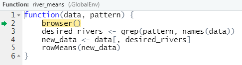

# Building an R Package {#r-package}

## What is an R Package? {#what-is-an-r-package}

An R package is a collection of code, data, documentation, and tests with a particular structure that can be shared with others. R packages are commonly downloaded from the Comprehensive R Archive Network (CRAN) ([external link](https://cran.r-project.org/)). You can install them from CRAN by running
```{r}
install.packages("package_name")
```
load them by running
```{r}
library(package_name)
```
and get help by running
```{r}
?package_name
```

One of the many reasons R packages are so useful is because they are the fundamental vessel by which to share R code. If your code is in a package, others can easily download and use it -- this is the essence of open-source software! Most R users have some experience with using at least one package, so they will likely be familiar with how to use yours after you share it. But sharing code is not the only benefit of creating packages -- a major benefit of using packages is that they enforce your code is built using a certain structure. Adhering to this structure

1. saves you time -- You don't need to think about how to organize your files because packages tell you how these files must be organized!
    * This rigid structure is especially helpful for me -- before I started creating packages my R scripts would be saved in all sorts of locations with no particular organization structure. This made it *very challenging* to come back to my work later and find a particular script.

2. gives you access to a set of standardized tools -- people have created many useful tools that work with R packages, so take advantage of them! 
    * e.g. devtools and usethis

3. forces you to frequently document your work
    * Before I started using R packages, when I would come back my old code, I was convinced someone else wrote it -- I basically had to rewrite it all to understand it. R packages help prevent this.
    
4. guides your research compendium

5. can make your research compendium completely reproducible and easy to share
    * This is because packages are built upon R projects (we discuss R projects in more detail in the [R Projects](#r-projects) section).

### Exercises {#ex-set1}

1. What are some of your favorite R packages?

2. Of those we have talked about so far, what benefits of R packages are most appealing to you?

## Creating an R Package

Next we will create the RPRW package together! If this is your first R package, then an extra special congratulations to you -- this is a big milestone! For those interested in viewing the source code of the RPRW package, visit the GitHub repository here ([external link](https://github.com/michaeldumelle/RPRW)).

### The Motivating Dataset

Suppose we want RPRW to summarize the length (in kilometers) and discharge (meters per second cubed) of North American rivers. Suppose we also want RPRW to easily accommodate many subsets of rivers based on their name. Below are our data of interest
```{r, eval = TRUE}
river <- data.frame(
  Missouri = c(3768, 1956),
  Mississippi = c(3544, 18400),
  Yukon = c(3190, 6340),
  Colorado = c(2330, 40),
  Arkansas = c(2322, 1004),
  Columbia = c(2000, 7730),
  Red = c(1811, 852),
  Canadian = c(1458, 174)
) 
rownames(river) <- c("length", "discharge")
river
```

If the structure of `river` is atypical to you, see [Exercise 3.7.1.1](#ex-set14).

### The First Step {#first-step}

The first step is using devtools to create a package template for us. There are a two ways to easily create this template. First, in the upper left-hand portion of the editor window (upper left-hand pane of RStudio), click "File" -> "New Project" -> "New Directory" -> "R Package" -> "Create Project". An alternative approach is to run
```{r}
devtools::create_package("path_to_RPRW_package/RPRW")
```

```{}
√ Creating 'path_to_RPRW_package/RPRW/'
√ Setting active project to 'path_to_RPRW_package/RPRW'
√ Creating 'R/'
√ Writing 'DESCRIPTION'
Package: RPRW
Title: What the Package Does (One Line, Title Case)
Version: 0.0.0.9000
Authors@R (parsed):
    * First Last <first.last@example.com> [aut, cre] (YOUR-ORCID-ID)
Description: What the package does (one paragraph).
License: `use_mit_license()`, `use_gpl3_license()` or friends to
    pick a license
Encoding: UTF-8
LazyData: true
Roxygen: list(markdown = TRUE)
RoxygenNote: 7.1.1
√ Writing 'NAMESPACE'
√ Writing 'RPRW.Rproj'
√ Adding '^RPRW\\.Rproj$' to '.Rbuildignore'
√ Adding '.Rproj.user' to '.gitignore'
√ Adding '^\\.Rproj\\.user$' to '.Rbuildignore'
√ Opening 'path_to_RPRW_package/RPRW/' in new RStudio session
√ Setting active project to '<no active project>'
√ Setting active project to 'path_to_RPRW_package/RPRW'
```

The package is held inside a folder named "RPRW" created at the the path on your computer named "path_to_RPRW_package". RStudio will automatically create a new window and you will see in the "Files" pane of RStudio (bottom right corner) there are several files (these are located at "path_to_RPRW_package/RPRW")
```{r, eval = TRUE, echo = FALSE, out.width = "100%"}
knitr::include_graphics("images/newrpack_files.PNG")
```

Notice the .Rproj file, which indicates that your package is also a project, so relative paths are used inside the package. Also notice  that the "Environment" pane of RStudio (top right corner) now has a "Build" tab -- this tab contains some useful tools for your R package.

### The First Function {#first-function}

R packages are composed of several functions that work together to accomplish a set of goals. The folder called "R" is where functions in your package live. Let's create our first function, called `river_means()`, which finds the mean river length and discharge of desired rivers. To create an R file in the R folder, run
```{r}
use_r("river_means")
```

You will see some output in the console
```{}
* Modify 'R/river_means.R'
* Call `use_test()` to create a matching test file 
```

and the appropriate file now in your R folder.
```{r, eval = TRUE, echo = FALSE, out.width = "100%"}
knitr::include_graphics("images/newrpack_function.PNG")
```

Generally, the name of your file should match the name of the function, and you should use separate files for separate functions. More experienced users, it is okay to break this rule every once in a while in certain contexts. 

The body of `river_means()` looks like
```{r, eval = TRUE}
river_means <- function(data, pattern) {
  desired_rivers <- grep(pattern, names(data))
  new_data <- data[, desired_rivers]
  rowMeans(new_data)
}
```

There are two arguments in `river_means()`: 

1. `data`: A data frame (whose rows represent length or discharge and whose columns represent rivers)
    * Making `data` the first argument makes this function easily pipeable ([external link](https://r4ds.had.co.nz/pipes.html))
2. `pattern`: A character pattern by which to subset the rivers in `data` before calculating means

There are three lines of code in `river_means()`:

1. Find the variables (rivers) in `data` whose names contain the pattern.
2. Subset `data` to include only the rivers whose names contain the pattern
3. Find the mean length and discharge of the rivers whose names contain the pattern

The object evaluated by the last line of code in a function is returned by default. So `river_means()` returns code evaluated in the third line of `river_means()`. You can force a different object to be returned earlier using `return(object)`.

You can leave comments in your function (by prefixing a line with `#`) to communicate in a non-programming language what your code is doing. This is usually good practice because it helps others (including future you) understand the intent of each line of code.

### `devtools::load_all()` {#load-all}

Now that we have written `river_means()` it is natural to want to try it out. One approach is to run `river_means()` (either in the "R/river_means.R" script or by copying and pasting `river_means()` into the console). Another approach is to load `river_means()` by running
```{r}
source("R/river_means.R")
```

These approaches put `river_means()` in the global environment (look at the environment pane in the upper-right hand corner of RStudio). Unfortunately messing around too much in the global environment can easily introduce errors or unintended behavior of your functions.

An alternative approach is to leverage devtools, since after all, you are bothering to create a package, so you may as well use the tools designed for them! The devtools function `devtools::load_all()` emulates the process of building, installing, and loading our R package. This has a few benefits. First, the functions are "sourced" into a better spot (not the global environment). Second, it makes all of your functions available through a single line of code -- rather than running and/or sourcing several functions separately. I highly recommend you practice using `devtools::load_all()` to load your functions rather than navigating the dangerous global environment. 
```{r}
devtools::load_all()
```

Now we get to try out `river_means()`! Suppose we want to summarize the rivers whose names start with "Mi" (in `river`, this is only Missiouri and Mississippi)?
```{r, eval = TRUE}
river_means(river, "Mi")
```

Next suppose we want to summarize rivers whose names start with "Y" (Yukon) or "R" (Red)?
```{r, eval = TRUE}
river_means(river, "Y|R")
```

Hooray -- our function works! Give yourself a congratulations :)! And for more on patterns and strings in R, visit here ([external link](https://r4ds.had.co.nz/strings.html)) and ([external link](https://bookdown.org/rdpeng/rprogdatascience/regular-expressions.html#sub-and-gsub)).

#### Exercises {#ex-set2}

1. How many functions does `river_means()` call within the body of the function? What package are these functions in?

2. Try using `river_means()` with a few different patterns. Do you notice anything strange?

### Creating Package Data {#creating-data}

So far the `river` data has been stored in global environment. What if you want to save this data in an easily accessible location and/or share it with others? Another package development tool to the rescue -- `usethis::use_data()` (are you starting to notice the benefits of the additional tools the package structure provides?). 
```{r}
usethis::use_data(river)
```

```{}
√ Creating 'data/'
√ Saving 'river' to 'data/river.rda'
```

You will see that at the root of your R package (inside "path_to_RPRW_package/RPRW"), there is now a folder called `data`. In `data`, there is a file called `river.rda`. `river_rda` contains the `river` data and can now be loaded by running `data("river")`. For illustration, let's remove `river` from our global environment and then load it using `data("river")` (similar to how we load data from other packages):
```{r}
rm(river) # remove the river data from our global environment
load_all() # emulate the package building, installation, and loading process
data("river") # load the river data
river # view the river data
```

```{r, eval = TRUE, echo = FALSE}
river
```

### roxygen Comments {#roxygen}

After writing `river_means()`, you should document it while its structure is fresh in your mind. This makes it easier for others (including future you) to understand how to use `river_means()`. Documenting R functions is a bit more complicated than leaving standard comments (`#`). Documenting R functions requires the use of a special type of comment -- *roxygen* comments (view the roxygen2 ([external link](https://roxygen2.r-lib.org/)) package for more). Roxygen comments are prefixed with `#'` (instead of `#` like for standard comments) and have special **tags** associated with them. roxygen comment templates are available and can be inserted by putting your cursor somewhere in the body of a function and either:

1. In the upper-left toolbar, go to "Code -> Insert Roxygen Skeleton"
2. Pressing `Ctrl/Cmd + Alt + Shift + R`

Inserting this roxygen template into `river_means()` yields
```{r}
#' Title
#'
#' @param data 
#' @param pattern 
#'
#' @return
#' @export
#'
#' @examples
river_means <- function(data, pattern) {
  desired_rivers <- grep(pattern, names(data))
  new_data <- data[, desired_rivers]
  rowMeans(new_data)
}
```

The `@` indicates the tag. The template inserts four tags for us: 

1. `@param`: to document function arguments
2. `@return`: to document function output
3. `@export`: to make the function available after installing the package
4. `@examples`: to provide examples of using the function

Let's document `river_means()`
```{r}
#' Means of river lengths and discharges
#'
#' @param data A data frame with two rows. The first row indicates river length and
#'   second row indicates river discharge. The columns of data indicate river names.
#' @param pattern A pattern by which to include only particular rivers
#'
#' @return The mean river length and mean river discharge for the desired rivers
#' @export
#'
#' @examples
#' data("river")
#' river_means(river, pattern = "Mi")
river_means <- function(data, pattern) {
  desired_rivers <- grep(pattern, names(data))
  new_data <- data[, desired_rivers]
  rowMeans(new_data)
}
```

Next we need to turn these roxygen comments into a new format that packages require before finishing documentation. The details of this new format are not critical -- the important take-away is that the roxygen comments are automatically transformed to the new format by running
```{r}
devtools::document()
```

```{}
i Updating RPRW documentation
i Loading RPRW
Writing NAMESPACE
Writing river_means.Rd
```

From now on I'll stop reminding you every time, but again, notice the benefits of leveraging tools that use the package structure. `devtools::document()` creates a new folder at the root of the package called `man` that now contains a file called `river_means.Rd`
```{r, eval = TRUE, echo = FALSE, out.width = "100%"}
knitr::include_graphics("images/newrpack_files2.PNG")
```

The `river_means.md` file is the result of transforming the roxygen comments to documentation that packages use. As you can see, `river_means.md` is a bit more complicated than the roxygen comments in `river_means()`. Luckily, `river_means.md` is automatically generated. The broader, important point of all this is that after running `devtools::document()`, you can view the documentation of `river_means()`! 
```{r}
?river_means
```

```{r, eval = TRUE, echo = FALSE, out.width = "100%"}
knitr::include_graphics("images/newrpack_example.PNG")
```

For more on documentation in R packages (including documenting data), visit here ([external link](https://r-pkgs.org/man.html#man)) and the vignettes here ([external link](https://cran.r-project.org/web/packages/roxygen2/index.html)). Though we skip documenting the river data here, the RPRW package available from GitHub does document it (the documentation can be viewed by running `?river` after `library(RPRW)`).

### The Second Function {#second-function}

You may be wondering how to tell your package to use functions from other packages. `river_means()`uses a few other functions available in R (see [Exercise 1.1.1.1](#ex-set1): `<-`, `grep()`, `names()`, `[`, and `rowMeans()`. How does R know how to use the right `names()` function when executing `river_means()`? These questions related to an package's NAMESPACE, which we discuss a bit later.

The functions used in `river_means()` are all from the base package in R ([external link](https://stat.ethz.ch/R-manual/R-devel/library/base/html/00Index.html)) (the base package is automatically installed alongside R). When using functions from the base package in your package, you don't have to give R any special warning. This is the only package that operates this way, however. When using functions from other packages in your package, you need to let R know what package that function comes from (this is true even for other packages automatically installed alongside R - stats, graphics, grDevices, utils, datasets, and methods). To illustrate this process, suppose we want to create a new function in our package called `river_medians()` that operates like `river_means()` but computes medians instead of means. First we create the script in our R folder by running
```{r}
use_r("river_medians")
```

Then we can write `river_medians()` (there is no `rowMedians()` function so we need to use `apply()` to summarize across rows -- see `?apply` for more detail):
```{r}
river_medians <- function(data, pattern) {
  desired_rivers <- grep(pattern, names(data))
  new_data <- data[, desired_rivers]
  apply(new_data, 1, median)
}
```

But wait! Run
```{r}
?median
```

See anything different? You'll notice that `median()` is in the stats package ([external link](https://stat.ethz.ch/R-manual/R-devel/library/stats/html/00Index.html)), not the base package. We need to let R know that when `river_medians()` uses `median()` from the stats package. To accomplish this, there are two steps to take. 

The first step is to tell your package that at least one function stats is required somewhere by running
```{r}
usethis::use_package("stats")
```

```{}
√ Adding 'stats' to Imports field in DESCRIPTION
* Refer to functions with `stats::fun()`
```

The package stats was added to the Imports field in the DESCRIPTION file at the root of your package. We will talk more about DESCRIPTION in a bit, but for now just remember that it contains metadata (high-level data) about your package. No matter how many times your package uses any function from stats, you only need to run `usethis::use_package("stats")` once.  

The second step is to tell `river_medians()` function to use the `median()` from stats. There are a few ways to do this. The way that is considered best practice is to preface any outside functions (aside from those in base) with `packagename::`. Incorporating this into `river_medians()` and inserting roxygen documentation yields
```{r}
#' Medians of river lengths and discharges
#'
#' @param data A data frame with two rows. The first row indicates river length and
#'   second row indicates river discharge. The columns of data indicate river names.
#' @param pattern A pattern by which to include only particular rivers
#'
#' @return The median river length and mean river discharge for the desired rivers
#' @export
#'
#' @examples
#' data("river")
#' river_medians(river, pattern = "Mi")
river_medians <- function(data, pattern) {
  desired_rivers <- grep(pattern, names(data))
  new_data <- data[, desired_rivers]
  apply(new_data, 1, stats::median)
}
```

Though this is way that is considered best practice, it does add some extra typing and can be cumbersome if you are using many outside functions. The `packagename::` prefix can be avoided by importing `median()` from stats to `river_median()` using the roxygen tag `@importFrom`:
```{r}
#' Medians of river lengths and discharges
#'
#' @param data A data frame with two rows. The first row indicates river length and
#'   second row indicates river discharge. The columns of data indicate river names.
#' @param pattern A pattern by which to include only particular rivers
#'
#' @return The median river length and mean river discharge for the desired rivers
#' @importFrom stats median
#' @export
#'
#' @examples
#' data("river")
#' river_medians(river, pattern = "Mi")
river_medians <- function(data, pattern) {
  desired_rivers <- grep(pattern, names(data))
  new_data <- data[, desired_rivers]
  apply(new_data, 1, median)
}
```

A third option is relevant if you are using several functions from stats. In this case, it may be easier to use the `@import` tag, which imports all functions from stats to `river_median()`.
```{r}
#' Medians of river lengths and discharges
#'
#' @param data A data frame with two rows. The first row indicates river length and
#'   second row indicates river discharge. The columns of data indicate river names.
#' @param pattern A pattern by which to include only particular rivers
#'
#' @return The median river length and mean river discharge for the desired rivers
#' @import stats
#' @export
#'
#' @examples
#' data("rivers")
#' river_medians(rivers, pattern = "Mi")
river_medians <- function(data, pattern) {
  desired_rivers <- grep(pattern, names(data))
  new_data <- data[, desired_rivers]
  apply(new_data, 1, median)
}
```

Be careful when using `@importFrom` or `@import`. If two functions from different packages have the same name and you try to use it in your function, R may not know which one to use. In these contexts, using the `packagename::` prefix is crucial.

#### Exercises {#ex-set3}

These exercises are challenging, so if they don't make sense now, that is okay! Make sure to re-review the solutions after the workshop.

1. Write a new function, `river_stats()`, that takes a data frame, pattern, and a general function by which to summarize river length and discharge. This general function should not be an actual function but rather a placeholder for a function a user inserts themselves.

2. Rewrite `river_stats()` from the previous exercise so that `river_stats()` also takes additional arguments to the summarizing function (hint: use `...` as an argument)

### DESCRIPTION {#description}

The DESCRIPTION file contains the R package's metadata (and was automatically installed when we created the R package). The DESCRIPTION file lets you easily track version numbers, authorship, and additional R packages that your R package uses. There are two fields in DESCRIPTION that do most of the communication regarding how your R package uses additional R packages:

1. Imports: Packages here must be installed in order for your package to work. As a result, any package listed in `Imports` will be installed alongside your package. Packages in `Imports` help build the foundation of your package.

2. Suggests: Packages here enhance your package but are not required for your package to work. You might use suggested packages for enhanced plotting, additional data sets, or more. Packages in `Suggests` can add finishing touches to your package, but they are not part of your package's foundation.

Other fields used to communicate how your R package uses additional R packages are `Depends`, `LinkingTo`, and `Enhances`. The difference between `Depends` and `Imports` is subtle -- the general advice is to use `Imports` instead of `Depends`.

Editing the package, title, author, and description fields of this package yield a DESCRIPTION file that looks like
```{}
Package: RPRW
Title: R Packages for Reproducible Workflows
Version: 0.0.0.9000
Authors@R: 
    person(given = "Michael",
           family = "Dumelle",
           role = c("aut", "cre"),
           email = "Dumelle.Michael@epa.gov")
Description: A companion R package for "Using R Packages for Reproducible Workflows"
    at the 2021 EPA R Workshop.
License: `use_mit_license()`, `use_gpl3_license()` or friends to pick a
    license
Encoding: UTF-8
LazyData: true
Roxygen: list(markdown = TRUE)
RoxygenNote: 7.1.1
Depends: 
    R (>= 2.10)
Imports: 
    stats
```

We will talk about some of the remaining parts of DESCRIPTION later.

### NAMESPACE {#namespace}

While the DESCRIPTION file communicates what packages your package *uses*, the NAMESPACE file communicates *how* your package uses these packages. More specifically, the NAMESPACE file controls which functions your package exports (making them available to others when your package is installed) and what functions from what packages must be available for your exported functions to work. The DESCRIPTION file is automatically updated while running `devtools::document()` and should not be edited by hand (in fact, there is a warning in the NAMESPACE file to warn against editing the file by hand)

In `river_median()`, if you called `median` using `stats::median`, your NAMESPACE file will look like
```{r}
# Generated by roxygen2: do not edit by hand

export(river_means)
export(river_medians)
```

If you used the `@importFrom stats median` approach, your NAMESPACE will look like
```{r}
# Generated by roxygen2: do not edit by hand

export(river_means)
export(river_medians)
importFrom(stats,median)
```

If you used the `@import stats` approach, your NAMESPACE will look like
```{r}
# Generated by roxygen2: do not edit by hand

export(river_means)
export(river_medians)
import(stats)
```

### testthat {#testthat}

Testing your code to make sure that it performs as intended is an important step in the package building process. Though this may seem like extra work upfront, implementing a rigorous testing procedure for your package is essential. In R, testing is incorporated into your package through the testthat ([external link](https://testthat.r-lib.org/)) package. To begin using testthat, run
```{r}
usethis::use_testthat()
```

```{}
√ Adding 'testthat' to Suggests field in DESCRIPTION
√ Setting Config/testthat/edition field in DESCRIPTION to '3'
√ Creating 'tests/testthat/'
√ Writing 'tests/testthat.R'
```

The root of your package directory should look like
```{r, eval = TRUE, echo = FALSE, out.width = "100%"}
knitr::include_graphics("images/newrpack_files3.PNG")
```

The tests folder should look like
```{r, eval = TRUE, echo = FALSE, out.width = "100%"}

```

Tests are generally written on a function-by-function basis. Tests for a function should be contained in an R script titled `test-function_name`. Luckily, `usethis::use_test()` creates an R script for you with the proper name! To start testing `river_means()`, run
```{r}
usethis::use_test("river_means")
```

```{}
√ Writing 'tests/testthat/test-river_means.R'
* Modify 'tests/testthat/test-river_means.R'
```

Your `testthat` folder should look like
```{r, eval = TRUE, echo = FALSE, out.width = "100%"}
knitr::include_graphics("images/newrpack_files5.PNG")
```

Tests can be fairly detailed and cover many components of a function (such as input types, output types, function output, etc.). The tests in testthat are prefixed with `expect_`. Here we write a simple test that calculates whether our function, `river_means()`, yields output that we would expect if we calculated the means "by hand":
```{r, eval = TRUE}
library(testthat) # testthat is installed with devtools but we must load it
testthat::test_that("the mean length is calculated correctly in a test case", {
  
  # calculate values required for the test for length

  ## calculate the means from the function
  river_means_val <- river_means(river, "Missouri|Mississippi")
  river_means_length <- river_means_val[[1]]

  ## calculate the means "by hand"
  raw_vec_length <- unlist(river["length", c("Missouri", "Mississippi")])
  raw_means_length <- mean(raw_vec_length)
  
  # perform the actual test for length

  ## check that the function and "by hand" output matches
  expect_equal(river_means_length, raw_means_length)
})
```

If you have many tests, the `devtools::test()` function runs all of the tests in the `testthat` folder:
```{r}
devtools::test()
```

```{}
i Loading RPRW
i Testing RPRW
√ |  OK F W S | Context
√ |   1       | river_means                                                     
                                               
== Results =========================================================================
[ FAIL 0 | WARN 0 | SKIP 0 | PASS 1 ]
```

We can write a similar test for discharge and then repeat the process for `river_meadians()`. Then `devtools::test()` returns
```{r}
devtools::test()
```

```{}
i Loading RPRW
i Testing RPRW
√ |  OK F W S | Context
√ |   2       | river_means                                                         
√ |   2       | river_medians                                                       

== Results =========================================================================
[ FAIL 0 | WARN 0 | SKIP 0 | PASS 4 ]
```

All tests pass -- hooray! I want to again emphasize how important testing is. I know that it seems like an extra chore, but in my experience, writing careful tests has always paid off...with interest.

#### Exercises {#ex-set4}

1. Write similar tests for `river_means()` (discharge), `river_medians()` (length), and `river_medians()` (discharge).

### License {#license}

At some point, your package needs a license. The license places restrictions on how your package can be shared with others. Licensing can be rather technical and complicated, so I refer you here ([external link](https://r-pkgs.org/license.html)) for more information. For illustration purposes, we will use a GPL-3 license for this package: 
```{r}
usethis::use_gpl_license()
```

```{}
√ Setting License field in DESCRIPTION to 'GPL (>= 3)'
√ Writing 'LICENSE.md'
√ Adding '^LICENSE\\.md$' to '.Rbuildignore'
```

`usethis::use_gpl_license()` adds the license to DESCRIPTION and creates a LICENSE.md file at the root of your package that contains information about the license. 

### Vignettes {#vignettes}

Vignettes act as high-level user guides for your package. They are the glue that binds together several components of your package to illustrate how the package can be used to solve a particular problem. Vignettes tend to be R Markdown documents. Though we cover R Markdown documents in more detail later, for now we note that they that dynamically interweave text and R code to form the foundation for fully reproducible documents created in R. R markdown documents have a `.Rmd` extension.

The ggplot2 ([external link](https://ggplot2.tidyverse.org/)) package is a popular package for visualizing data. After installing ggplot2
```{r}
install.packages("ggplot2")
```
you can view its available vignettes by running
```{r}
vignette(package = "ggplot2")
```

after which a file will pop up alongside your R scripts with the contents
```{r, eval = TRUE, echo = FALSE, out.width = "100%"}
knitr::include_graphics("images/newrpack_files6.PNG")
```

To then  view a specific vignette, run `vignette(topic, package)`. For example, to view the vignette regarding **aes**thetic specifications, run
```{r}
vignette("ggplot2-specs", "ggplot2")
```

The vignette can be viewed in the bottom-right pane of RStudio. Vignettes are also available on a package's CRAN page -- for the ggplot2 aesthetic specifications vignette, see here ([external link](https://cran.r-project.org/web/packages/ggplot2/vignettes/ggplot2-specs.html)).

Suppose we want to include a vignette that shows how to use RPRW to compute river statistics. Running
```{r}
use_vignette("river-statistics", "River Statistics")
```

```{}
√ Adding 'knitr' to Suggests field in DESCRIPTION
√ Setting VignetteBuilder field in DESCRIPTION to 'knitr'
√ Adding 'inst/doc' to '.gitignore'
√ Creating 'vignettes/'
√ Adding '*.html', '*.R' to 'vignettes/.gitignore'
√ Adding 'rmarkdown' to Suggests field in DESCRIPTION
√ Writing 'vignettes/river-statistics.Rmd'
* Modify 'vignettes/river-statistics.Rmd'
```

does a few things. It alters your DESCRIPTION file, most notably adding the knitr ([external link](https://yihui.org/knitr/)) and rmarkdown packages to the `Suggests` field.  It also creates a vignette folder at the root of your package and adds to that folder an rmarkdown vignette (notice the `.Rmd` extension) named `river-statistics.Rmd` whose title is "River Statistics".

While we won't create a vignette for our package during the workshop, I have added a vignette to the RPRW package. To view it (after installation), run
```{r}
vignette(river-statistics, "RPRW")
```

### `devtools::check()` {#check}

At this point we have built R package and are ready to share it with the world! But we should probably check to make sure we did not make any small mistakes. Does devtools have a way to do this? Of course -- introducing `devtools::check()`! `devtools::check()` evaluates several automated tests on your package to make sure it can be properly installed and shared  -- this can take a few minutes. The `devtools::check()` output lists errors, warnings, and notes associated with your package. Though the warnings and notes are important, it is most crucial to address the errors immediately. 

Hopefully your output after running `devtools::check()`, your output looks like
```{}
-- R CMD check results ---------- RPRW 0.0.0.9000 ----
Duration: 34.4s

0 errors √ | 0 warnings √ | 0 notes √
```

If not, do your best to fix the errors and address the warnings and notes!

### `devtools::install()` {#install}

After `devtools::check()` identifies zero errors (and hopefully zero warnings and notes), you can install your package by running
```{r}
devtools::install()
```

After installing RPRW, you can use `library(RPRW)` to load it like you do any other R package.

#### Exercises {#ex-set5}

1. Find the argument to `devtools::install()` that identifies whether vignettes are built alongside installation. What is the default value of this argument?

### Congratulations {#congratulations}

Congratulations on building an R package! If this was your first one, then an extra special congratulations to you! Hopefully stepping through the process together made it all less intimidating.

```{r, eval = TRUE, echo = FALSE, out.width = "50%"}

```

## Debugging {#debugging}

Even the best of programmers write code that may fail in unintended ways. This unintended failing of code is referred to as a "bug," and the process of fixing the "bug" is known as "debugging". Don't expect to always write perfect code -- do expect to have the tools necessary to track down bugs and remedy them. Though we went through a rigorous documentation and testing procedure when creating `river_means()` and `river_medians()`, there are still bugs present in these functions.

### A Mysterious Error Message {#error-onematch}

We have already used `river_means()` and `river_medians()` to successfully find means and medians for several patterns. But running `river_means(river, "R")` yields a mystifying error:
```{r, eval = TRUE}
river_means(river, "R")
```

Something is wrong -- and we need to figure out what. A good first step is to copy and paste the error into a Google search engine and see if anyone has solved the problem yet. If you are lucky, this approach will identify the bug for you. If you are not so lucky, you need to try a different approach. Fortunately, R has built-in tools that can help you track down bugs -- we will explore a few of these tools next.

### `traceback()` {#traceback}

The `traceback()` function is generally run in the console after receiving an error. `traceback()` identifies where the error occured in the previous function call. Here we run `traceback()` after `river_means(river, "R")`:
```{r}
traceback()
```

```{}
3: stop("'x' must be an array of at least two dimensions")
2: rowMeans(new_data) at #4
1: river_means(river, "R")
```

We now know that the error occurs in Line 4 of `river_means()` (the `rowMeans(new_data)` step). While this is very useful information, we still don't know exactky why the error occurs.

### `browser()` {#browser}

In my early stages of debugging, I would save my arguments to a function in the global environment and then run through each line of the function returning the error, effectively "recreating" the environment in which the error occurred. Perhaps some of you have done this too. The bad news is that this approach is often error-prone and inefficient. The good news is that there is a better way -- `browser()`. Inserting `browser()` into your code and then running it lets you interactively step into the function, starting at wherever `browser()` is located. No more saving arguments to the global environment and running code line-by-line! Let's try this out with `river_means()`:

```{r}
river_means <- function(data, pattern) {
  browser()
  desired_rivers <- grep(pattern, names(data))
  new_data <- data[, desired_rivers]
  rowMeans(new_data)
}
```

After using `devtools::load_all()` and running `river_means()`, you will step into the function before the first line of code. For example,
```{r}
river_means(river, "R")
```

opens a new file in the editor (upper left-hand) window that looks like
```{r, eval = TRUE, echo = FALSE, out.width = "75%"}

```

You will also see a few buttons in the R console (lower left-hand) window:
```{r, eval = TRUE, echo = FALSE, out.width = "75%"}
knitr::include_graphics("images/newrpack_files8.PNG")
```

These five buttons help you interactively navigate through `river_means()`. From left to right, they are

* Next (`n`), which executes the next line of the code
* Step (`s`), which steps into the function called by the current line of code
* Finish (`f`), which finishes execution of the current function
* Continue (`c`), which leaves the interactive context and continues execution of the function
* Stop (`Q`), which leaves the interactive context and terminates execution of the function

Before navigating through any lines of `river_means()`, we see `data` and `pattern` are defined:
```{r, eval = TRUE, echo = FALSE}
data <- river
pattern <- "R"
```

```{r, eval = TRUE}
print(data)
print(pattern)
```

Pressing `n` (Next) executes `browser()`. Pressing `n` (Next) again executes
```{r, eval = TRUE}
desired_rivers <- grep(pattern, names(data))
```

Inspecting `desired_rivers`, we see
```{r, eval = TRUE}
print(desired_rivers)
```

This seems correct, as the seventh river, "Red", does match the pattern "R". So the error isn't here. Let's press `n` (Next) to evaluate the next line
```{r, eval = TRUE}
new_data <- data[, desired_rivers]
```

Inspecting `new_data`, we see
```{r, eval = TRUE}
new_data
```

Well this seems weird -- `new_data` does not look like a data frame. Let's inspect the structure
```{r, eval = TRUE}
str(new_data)
```

`new_data` is in fact not a data frame, but rather it is a numeric vector. Because `rowMeans()` requires an array of two or more dimensions (e.g. a matrix or data frame), the next line of code, `rowMeans()`, fails. Pressing `n` again returns the error and removes you from the interactive mode:
```{r, eval = TRUE}
rowMeans(new_data)
```

This is a good example of one of the reasons debugging can be so challenging: often, an error occurs because code from a few lines back runs in an unintended way (even though it runs successfully). Note that a similar error occurs when running `river_medians(river, "R")` because `apply()` requires an array of two or more dimensions.

So what is happening here? We know the code works when the pattern yields at least two matches in `river`. But now, with one match, the code is failing. Let's start with the `[` function called by `data[, desired_rivers]`, where we receive unintended output. Let's look at the documentation of `[` by running
```{r}
?`[`
```

A close look at the documentation reveals further documentation for the behavior of `[` when applied to a data frame
```{r}
?`[.data.frame`
```


Notice the `drop` argument in this documentation. The `drop` argument, when `TRUE`, coerces the object to the lowest possible dimension. When subsetting a data frame by one column, `drop` is `TRUE`  by default and data frame structure is turned into a vector structure, which only has one dimension -- this is why the error is occurring. So we need to force our subsetting to always keep the data frame structure by setting `drop = FALSE`. Accommodating this change in `river_means()` and `river_medians()` yields functions that look like
```{r, eval = TRUE}
river_means <- function(data, pattern) {
  desired_rivers <- grep(pattern, names(data))
  new_data <- data[, desired_rivers, drop = FALSE]
  rowMeans(new_data)
}

river_medians <- function(data, pattern) {
  desired_rivers <- grep(pattern, names(data))
  new_data <- data[, desired_rivers, drop = FALSE]
  apply(new_data, 1, median)
}
```

Now running `river_means()` and `river_medians()` with patterns only having one match behaves as intended
```{r, eval = TRUE}
river_means(river, "R")
river_medians(river, "R")
```

For more information about debugging in R, watch this ([external link](https://www.rstudio.com/resources/rstudioconf-2020/object-of-type-closure-is-not-subsettable/)) and/or read this ([external link](https://adv-r.hadley.nz/debugging.html)).

### Another Error -- No Mysterious Message {#error-zeromatch}

We previously received and fixed an error message that occurred when the pattern only matched one river. So we know our code works when the pattern matches at least one river. But what happens when the pattern matches zero rivers?
```{r, eval = TRUE}
river_means(river, "ZZZ")
```

The length and discharge means are `NaN`, which stands for "Not a Number" -- this is certainly unintended (note that `river_medians(river, "ZZZ")` returns similar output.). These types of bugs are especially pernicious because there is no error message associated with them -- we can't use `traceback()`. Say `river_means()` was a small part of a much larger function, -- this bug could be the root of a confusing error several lines later. Whenever function output is unexpected and you can't immediately figure out why, use `browser()` to diagnose the bug. In this context, `desired_rivers` is a length-zero vector, which causes problems in the remaining parts of the function. To guard against these types of bugs, identify potentially problematic scenarios for your function and program defensively, forcing the function to return an informative error message when a problematic scenario is identified. Here we force `river_means()` to return an error message when the pattern matches zero rivers:
```{r, eval = TRUE}
river_means <- function(data, pattern) {
  desired_rivers <- grep(pattern, names(data))
  if (length(desired_rivers) == 0) {
    stop("This is an error message that stops the function.")
  }
  new_data <- data[, desired_rivers, drop = FALSE]
  rowMeans(new_data)
}
river_means(rivers, "ZZZ")
```

#### Exercises {#ex-set6}

1. Rewrite `river_medians()` so that it stops and returns an informative error message when the pattern matches zero rivers.

## Additional Resources {#add-resources}

* R Packages ([external link](https://r-pkgs.org/index.html)) by Hadley Wickham ([external link](http://hadley.nz/)) and Jenny Bryan ([external link](https://jennybryan.org/)) [@wickham2015r]
* Writing an R package from scratch ([external link](https://hilaryparker.com/2014/04/29/writing-an-r-package-from-scratch/)) by Hilary Parker ([external link](https://hilaryparker.com/))
* Writing R Extensions ([external link](https://cran.r-project.org/doc/manuals/r-release/R-exts.html)) by CRAN (this resource is very technical)