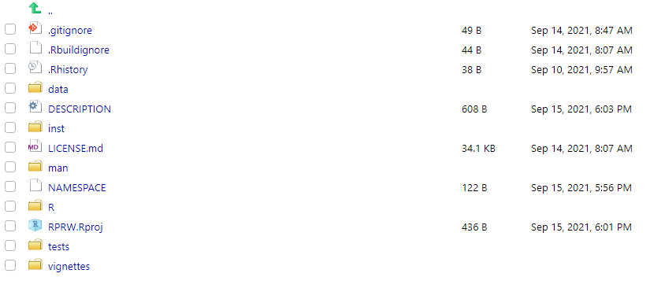
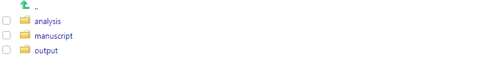

# Making an R Package a Research Compendium {#r-package-rc}

## What is a Research Compendium? {#what-is-a-rc}

@marwick2018packaging state that the goal of a research compendium is to provide a standard and easily recognizable way to organize the digital materials of a project to enable others to inspect, reproduce, and extend the work. Three generic principles define a research compendium:

1. Files should be organized according to the prevailing conventions of a broader community. This helps members of the community recognize the structure of the project and make tools that utilize the structure.

2. There should be a clear separation of data, methods, and output. For example, raw data should be kept separate from the code that cleans the data so that others can access the raw data.

3. The computational environment for the methods should be clearly specified. At the most basic level, this means recording the names and version numbers of software. At the most detailed level, this means completely reproducing the computing environment.

### Exercises {#ex-set7}

1. What principles of a research compendium seem most beneficial to you?

## Why a Research Compendium? {#why-a-rc}

@marwick2018packaging (and references therein) give several benefits of a research compendium:

* A convenient way to publicly share data and code
* Work with publicly available data sets may receive higher numbers of citations than work with private data sets (note that publicly available data sets also tend to be easier to clear through EPA platforms)
* Data sharing is associated with higher publication productivity
    * Of 7,040 NSF and NIH awards studied, the median number of publications associated with each research grant was five when the data were private and 10 when the data were public
* Structured and simplified file management and workflows
* More defense against errors
* Easier to communicate with others (and future you)

### Exercises {#ex-set8}

1. Can you identify any benefits to a research compendium that are not already on this list?

## Why an R Package for a Research Compendium? {#why-r-pack-for-rc}

As previously mentioned, a research compendium requires a specific structure. Earlier in this workshop, we got some experience with something in R that also requires a specific structure............R packages! A research compendium can significantly benefit from adopting the structure of an R package. Organization is simpler (as you already have a structure), writing and documenting functions and data helps guard against errors in an analysis, and devtools and usethis have several development tools to help ensure your R package performs as intended. 

We have previously discussed how to include data in an R package, but many of you may be wondering how we include additional pieces of a research compendium like analysis scripts, output, or a manuscript itself. If the structure of an R package is so rigid -- how do these pieces fit? We discuss one such approach next.

## Turning RPRW Into A Research Compendium {#rprw-to-rc}

If a folder named `inst` is placed at the root of an R package's directory, all of the raw contents in `inst` will be installed upon installation of the R package. This is where we can put the pieces of our research compendium that are not explicitly related to the previous implementation of our R package. We can use this approach to turn RPRW into a research compendium.

Suppose we are using RPRW to supplement a manuscript about rivers. Let's first add the `inst` folder -- the root of your package's directory should look similar to 
```{r, eval = TRUE, echo = FALSE, out.width = "100%"}

```

Let's add three folders to `inst`:

1. `analysis` for our analysis scripts -- these scripts contain code that is not related to the functions in the package but is related to other parts of the research compendium (e.g. generating output for the manuscript)
2. `output` for our analysis output
3. `manuscript` for our manuscript
```{r, eval = TRUE, echo = FALSE, out.width = "100%"}

```

First we will make an R script to put in `analysis`. Recall that in Exercise 1.2.7.1.2 ([internal link](#ex-set3)), we generated `river_stats()`, whose body looks like
```{r}
river_stats <- function(data, pattern, FUN, ...) {
  desired_rivers <- grep(pattern, names(data))
  new_data <- data[, desired_rivers]
  apply(new_data, 1, FUN, ...)
}
```

`river_stats()` works like `river_means()` and `river_medians()` but takes a general function instead of computing the mean or median specifically. Suppose our goal is to find the minimum length and discharge for rivers whose names contain "C". Our script to put in `analysis` will look like
```{r}
# find some summary statistics on rivers with pattern "C"

## load RPRW -- we need to do this because the script is separate from the 
  ## functions installed in the RPRW package
library(RPRW) 

## find minimums
river_min <- river_stats(river, "C", min)

## make a data frame of the minimums
min_df <- data.frame(
  data = "river",
  pattern = "C",
  length_min = river_min[[1]],
  discharge_min = river_min[[2]]
)

## write out the minimums (without row names)
write.csv(min_df, "inst/output/min_df", row.names = FALSE)
```

This script loads RPRW and finds the minimum length and discharge for rivers whose names start with C. The script then saves the contents to a CSV file in the `output` folder. These contents are used when building the manuscript. The manuscript is in the `manuscript` folder and is a completely reproducible R Markdown document (using an rticles template, which we discuss later). Though we won't discuss the details of this R Markdown document here unless we have time, the files can be viewed on your machine (after installing RPRW) at the location provided by
```{r}
system.file("manuscript", package = "RPRW")
```

A compiled PDF of the manuscript is available here ([external link](https://github.com/michaeldumelle/RPRW/blob/main/inst/manuscript/manuscript.pdf)). 

### Exercises {#ex-set9}

1. There is a folder name within `inst` that should be avoided -- what is it?

### Adding a Citation {#citation}

Often times your research compendium may be centered around a particular publication. You may build an R package that deals with specific tasks and then write your manuscript using the research compendium structure. In this event, you may want your publication to be easily citeable. You can add a citation to your R package research compendium by running
```{r}
use_citation()
```

```{}
√ Writing 'inst/CITATION'
* Modify 'inst/CITATION'
```

The citation file is placed in the `inst` folder. It looks a little intimidating at first, but it automatically creates a text version and LaTeX version of your citation with relatively little ease. Here is raw code I used to create the citation in the RPRW package
```{r}
citHeader("To cite RPRW in publications use:")

citEntry(
  entry    = "Manual",
  title    = "Using R Packages for Reproducible Workflows",
  author   = personList(as.person("Michael Dumelle")),
  journal  = "EPA 2021 R Workshop",
  url      = "https://github.com/michaeldumelle/R-Packages-Reproducible-Workflows-Book",
  textVersion =
  paste(
    "Michael Dumelle.",
    "(2021).",
    "Using R Packages for Reproducible Workflows.",
    "EPA 2021 R Workshop.",
    "URL https://github.com/michaeldumelle/R-Packages-Reproducible-Workflows-Book."
  )
)
```

To view the citation, run
```{r, eval = TRUE}
citation(package = "RPRW")
```

If left unedited, the package citation defaults to something that looks like
```{}
 
 To cite package 'RPRW' in publications use:
 
   Michael Dumelle (2021). RPRW: R Packages for Reproducible Workflows.
   R package version 0.0.0.9000.
 
 A BibTeX entry for LaTeX users is
 
   @Manual{,
     title = {RPRW: R Packages for Reproducible Workflows},
     author = {Michael Dumelle},
     year = {2021},
     note = {R package version 0.0.0.9000},
   }
```

## Research Compendium Recap {#rc-recap}

The research compendium now visibly contains:

* `data`: a folder containing data
* `DESCRIPTION`: a file containing metadata about our package
* `inst`: a folder containing auxiliary files to be downloaded alongside the package's installation
    * `analysis`: a folder containing R scripts that are separate from the R package but used as part of the research compendium
    * `CITATION`: a file containing citation information
    * `manuscript`: a file containing the manuscript and auxiliary files
    * `output`: a file containing the CSV output
* `LICENSE.md`: a file containing metadata about our license (GPL-3)
* `man`: a folder containing R function documentation from the package
* `NAMESPACE`: a file containing exports and imports
* `R`: a folder containing R functions from the package
* `RPRW.Rproj`: a file containing R Project metadata
* `tests`: a folder containing R function testing
* `vignettes`: a folder containing the package vignette

You can also add a `README.md` file to give a broad overview of your package (`README.md` is useful whether or not you use Git and GitHub). The `README.md` file is a Markdown ([external link](https://www.markdownguide.org/)) file (notice the .md extension and notice the connection between R Markdown (`.Rmd`) and Markdown (`.md`)) in the RPRW package that looks like
```{}
# RPRW
Companion R package for "Using R Packages for Reproducible Workflows" at the 2021 EPA R Workshop

```

## Sharing Your Research Compendium {#sharing-rc}

So now you have a research compendium that combines your R functions with your data, code, and manuscript to create a reproducible product that is easy to share with your colleagues. But how do we share it? Running
```{r}
devtools::build()
```

will build an R package for you. By default, the package will be located in the same folder as the folder containing your R package with name "package-name_version-number.tar.gz". Note that this is one level above the location of your R package's directory. For example, if folder "A" holds "RPRW", which is the folder containing all of the files associated with my R package, then using `devtools::build()` will install "RPRW_0.0.0.9000.tar.gz" in folder "A". 

After building the package, you can send it to a colleague, they can save it on their machine, and then they can install it by running
```{r}
install.packages(path_to_package, repos = NULL, type = "source")
```

If your colleague doesn't remember where they saved the file, they can interactively search for it by running
```{r}
install.packages(file.choose(), repos = NULL, type = "source")
```

Because R packages leverage R projects your colleague can immediately run any of your code on their machine (a reminder that we discuss R projects soon)!

### Exercises {#ex-set10}

1. Run `?devtools::build` to look at some additional arguments -- which seem useful to you?

## An Example R Package Reserach Compendium {#ex-rc}

A recent publication of mine used this R package research compendium structure -- you can view the GitHub repository here ([external link](https://github.com/michaeldumelle/DumelleEtAl2021STLMM)).