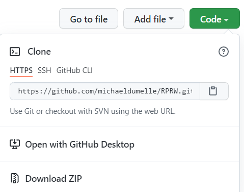

# Extensions {#extensions}

## R Projects {#r-projects}

When I first started coding in R, I would try to share my code with others and encountered a problem -- my colleagues would copy, paste, and run my code but it would not work on their machine. Often this was because my scripts read in files from different file paths (locations) on my computer -- and these file paths were unique to my machine!, To get my code to work, my colleagues would have to edit my code that used file paths so that they pointed to the correct files on their machine. Not only is this a lot to ask of someone, it also makes it incredibly error-prone. More often than not, I would have to meet with someone to get the code I sent them up and running. This was a waste of time for everyone involved. 

R looks for files to load in a working directory. This is helpful because looking for files in a working directory prevents you from having to type out the full path to a file every time you want to load something. For example, suppose you are not using a working directory and you have several files to load that live in `a/long/path/with/s p a c e s/and/cH-a_r--aCt-er$!!!`. To load `my_cool_file.csv` and `my_other_cool_file.csv`, you have to run
```{r}
read.csv("a/long/path/with/s p a c e s/and/cH-a_r--aCt-er$!!!/my_cool_file.csv")
```

and then retype (or copy/paste) the path to run
```{r}
read.csv("a/long/path/with/s p a c e s/and/cH-a_r--aCt-er$!!!/my_other_cool_file.csv")
```

This workflow is tedious and error-prone. If you set your working directory to `a/really/long/path/with/s p a c e s/and/cH-a_r--aCt-er$!!!`, then to load `my_cool_file.csv` and `my_other_cool_file.csv`, you have to run
```{r}
read.csv("my_cool_file.csv")
read.csv("my_other_cool_file.csv")
```

You can set working directories in R using `setwd()`, but this isn't really a good idea for various reasons (you get to discuss them in the exercises). There is a better way to control your working directory -- R projects!

R projects automatically set your working directory to live wherever the project is stored on your machine. So if I have `my_cool_file.csv` and `my_other_cool_file.csv` in the root (top-most level) of my R project, I can load them by running
```{r}
read.csv("my_cool_file.csv")
read.csv("my_other_cool_file.csv")
```

while inside the R project. This is so powerful because that means I can bundle up my R project, send it to my colleague, and then the R project will set my colleague's working directory to live wherever they save the project. That means that they can load `my_cool_file.csv` and `my_other_cool_file.csv` using the exact same code I used. No more file path problems -- this is a vastly improved workflow. It may not seem like a big deal now, but learning how to use R projects makes sharing your work substantially easier.

A side benefit of R projects is that they provide a convenient structure by which to organize all the files associated with a particular task. To learn more about creating and maintaining R packages, visit here ([external link](https://r4ds.had.co.nz/workflow-projects.html)) and here ([external link](https://support.rstudio.com/hc/en-us/articles/200526207-Using-Projects)). If you do not use R projects yet, I recommend that you start.

### Exercises {#ex-set11}

1. What are some drawbacks of running `setwd()` whenever you want to set a working directory?

2. Look into the here ([external link](https://here.r-lib.org/)) package, designed to help solve working directory problems (that can even occur within R Projects).

### renv {#renv}

The renv ([external link](https://rstudio.github.io/renv/articles/renv.html)) package brings R package version management to your projects. renv prevents code in your R project from returning separate results based on the version of the R packages installed. It works by saving the specific versions of the R packages in your project and then makes it easy for others to install those same versions before running code in the project. 

## R Markdown {#rmarkdown}

R Markdown documents provide a convenient way to combine text, R code, and results into a fully reproducible document that compiles (knits) to one of several output types (HTLM, PDF, word, slide decks, etc.). An R Markdown document has file extension `.Rmd` and can be created in RStudio by clicking "File -> New File -> R Markdown", which brings up the following options
```{r, eval = TRUE, echo = FALSE, out.width = "100%"}
knitr::include_graphics("images/rmark1.PNG")
```

Pressing OK automatically opens a file with several contents

````md
---
title: "Untitled"
author: "Michael Dumelle"
date: "9/17/2021"
output: html_document
---

```{r setup, include=FALSE}`r ''`
knitr::opts_chunk$set(echo = TRUE)
```

## R Markdown

This is an R Markdown document. Markdown is a simple formatting syntax for authoring HTML, PDF, and MS Word documents. For more details on using R Markdown see <http://rmarkdown.rstudio.com>.

When you click the **Knit** button a document will be generated that includes both content as well as the output of any embedded R code chunks within the document. You can embed an R code chunk like this:

```{r cars}`r ''`
summary(cars)
```

## Including Plots

You can also embed plots, for example:

```{r pressure, echo=FALSE}`r ''`
plot(pressure)
```

Note that the `echo = FALSE` parameter was added to the code chunk to prevent printing of the R code that generated the plot.
````

* The part surrounded by ```---``` is the YAML header, which contains metadata about your document -- big picture options are controlled here. For more on YAML headers, check out the ymlthis package and its associated vignettes here ([external link](https://cran.r-project.org/web/packages/ymlthis/index.html)).

* The parts prefixed by `#` are first-level (section-level) headers, and the parts prefixed by `##` are second level (subsection-level) headers.

* The parts surrounded by ```` ``` ```` are code chunks -- these are the engine that powers R Markdown. Code chunks let you run and display R code and output in your document. More generally, code chunks look like

````md
```{r label, chunk_options}`r ''`
R code
```
````

* The line

```md
knitr::opts_chunk$set()
```
lets you set default options for your code chunks. For example, `knitr::opts_chunk$set(echo = TRUE)` sets `echo = TRUE` for all all code chunks, unless a particular code chunk sets `echo = FALSE`. More information on available code chunk options is available here ([external link](https://yihui.org/knitr/options/)). 

* The rest of the document contains the body of the document -- the plain text.

For more on the structure of R Markdown documents, visit here ([external link](https://bookdown.org/yihui/rmarkdown-cookbook/conceptual-overview.html)).

R Markdown documents are useful for a variety of reasons, two of which we will focus on next:

1. R Markdown lets you create fully reproducible documents by combining R code and text (these are often called **dynamic** documents). What if there is a slight change to the data? No problem, the tables or figures are reproduced when re-knitting. What if you want to use a new output style (like a PDF or Word Document)? No problem, just change `output:` and re-knit. 
2. This approach is less error-prone and usually less work compared to the alternative approach of remaking tables, figures, etc. "by hand" and the inserting them manually into your document..

For much, much more on R Markdown, read this ([external link](https://bookdown.org/yihui/rmarkdown/)) and this ([external link](https://bookdown.org/yihui/rmarkdown-cookbook/)). I highly recommend you get some experience with it, as its tools are immensely powerful.

### Exercises {#ex-set12}

1. What benefits do you see to R Markdown documents?

2. Save the basic R Markdown template we just discussed and knit it to see its contents.


## rticles {#rticles}

The rticles package is an extension of R Markdown designed to make adhering to journal style requirements easier. Some journal types rticles accommodates are Elsevier, PLOS, Sage, Springer, and Taylor & Francis, among others. After installing rticles (`install.packages("rticles")`), you can access article templates by starting a new R Markdown document and selecting the template tab
```{r, eval = TRUE, echo = FALSE, out.width = "100%"}
knitr::include_graphics("images/rmark2.PNG")
```

The rticles templates have complicated YAML headers, but they generally have pretty clear inline instructions for how to edit them. The YAML headers change between templates, but the body of the document is just standard R Markdown (potentially with some LaTeX). This is very convenient because the body of the document is the same across templates (potentially with minor LaTeX discrepancies that are generally explained in the template's inline instructions). Decide you want to switch from an Elsevier journal to a Taylor & Francis journal? No problem, just change the template type! For this reason, rticles is one my favorite R packages.

For a brief introduction LaTeX, see this ([external link](https://www.overleaf.com/learn/latex/Learn_LaTeX_in_30_minutes)). While some working knowledge of LaTeX is not necessarily required to successfully use rticles, it can be immensely helpful.

### Exercises {#ex-set13}

1. Visit this ([external link](https://github.com/rstudio/rticles)) to see all the journals that rticles has a template for.

## Git and GitHub {#git-github}

I highly recommend you learn how to use Git and GitHub. Though intimidating, frustrating, and time-consuming at first, Git and GitHub are well worth the effort. Git ([external link](https://git-scm.com/)) is a version control system. A version control system keeps track of all changes made to your code in a Git repository (which is a `.git/` folder somewhere in your code -- note the `.git/` folder is usually hidden). Git is useful on its own, but it benefits greatly from integration with GitHub. GitHub ([external link](https://github.com/)) is a website that lets you easily share your code, collaborate with others, track changes to your code, and backup your code, among other features. Git and GitHub is by far the most popular version control system for R packages, and access to development versions of R packages is usually only available through GitHub.
```{r}
devtools::install_github("username/packagename")
```

Though we won't get into details of Git and GitHub here (aside from a quick example we discuss next), luckily RStudio has many tools to enable R to communicate with Git and GitHub. For an intro to Git and GitHub through RStudio, visit this ([external link](https://r-pkgs.org/git.html)). For a thorough book about using Git and GitHub through RStudio, visit this ([external link](https://happygitwithr.com/)). For a video overview of using Git and GitHub through RStudio, watch this ([external link](https://www.rstudio.com/resources/rstudioconf-2017/happy-git-and-gihub-for-the-user-tutorial/)).

### Cloning a GitHub Repository in RStudio

After ensuring GitHub and R Studio can talk to one another, one GitHub and RStudio workflow is to create a repository on GitHub and then clone it using RStudio. After creating the repository on GitHub, copy the HTTPS URL:
```{r, eval = TRUE, echo = FALSE, out.width = "100%"}

```

Then go to "File -> New Project -> Version Control -> Git". Copying and pasting the HTTPS URL in the "Repository URL:" field and pressing "Create Project" clones the repository and creates an R project in a folder with name given by the "Project directory name:" field (which defaults to the repository name) located at the "Create project as subdirectory of:" field. You can then use `usethis::create_package()` to turn the repository into an R package (note that `usethis::create_package(".")` creates a package in the current working directory).

### `.gitignore`

The `.gitignore` file in your package files deserves some special attention. Similar to `.Rbuildignore`, `.gitignore` contains file paths that are stored locally but not meant to be put on GitHub. For more on `.gitignore`, visit here ([external link](https://r-pkgs.org/git.html#git-ignore)).

## Continuous Integration {#ci}

Continuous integration (often abbreviated CI) is the process of performing automated checks on code anytime it is updated. This may seem cumbersome, but it is a really good idea because it forces you to check for errors with every new version of code. One option for continuous integration in your R package's GitHub repository is GitHub Actions ([external link](https://github.com/features/actions)). devtools has several tools to help you set up GitHub actions. I recommend using their "standard" GitHub actions template, which can be added to your R project by running

```{r}
use_github_action(name = "check-standard")
```

```{}
√ Creating '.github/'
√ Adding '^\\.github$' to '.Rbuildignore'
√ Adding '*.html' to '.github/.gitignore'
√ Creating '.github/workflows/'
√ Writing '.github/workflows/check-standard.yaml'
* Learn more at <https://github.com/r-lib/actions/blob/master/examples/README.md>
```

You will notice that this code created a new folder at the root of our package named `.github`. The .github folder may be hidden so you may need to enable the viewing of hidden files to look through its contents on your machine (in the files pane of R studio click more and check "show hidden files". Then every time you push to GitHub, GitHub actions will simulate `devtools::check()` on several operating systems (Windows, Mac, Linux) and return the results. To view this approach implemented for the RPRW package, visit this ([external link](https://github.com/michaeldumelle/RPRW/actions)).  Another option for continuous integration is Travis CI ([external link](https://travis-ci.org/)).

## Reproducible Examples {#reprex}

If you want to solicit help regarding your code from others, it is helpful if your code is a reprex. A reprex is a reproducible example. Creating a reprex gives others the ability to look at and run your code with the intent of solving the problem you have. Conversations about code are more productive with

1. code that actually runs (the code should work on your machine as intended)
2. code that I don't have to run (I should be able to see your output without actually having to run the code)
3. code that I can easily run (I should be able to run the code on my machine and obtain the same results as you)
To accomplish all three above, the code should

* Be run in a new R session
* Load all necessary packages
* Create all necessary objects
* Be self-contained (don't use anything form outside the reprex)
* Contain the code as well as the output
* Run properly on both our machines

How do you ensure your example is a reprex (satisfies the above properties)? Use the reprex package! See here ([external link](https://reprex.tidyverse.org/)) for more information about reprex and here ([external link](https://cran.r-project.org/web/packages/reprex/vignettes/reprex-dos-and-donts.html)) and for some do's and don'ts of a reprex. Finally, see here ([external link](https://www.youtube.com/watch?v=5gqksthQ0cM)) for a video introduction to reprex with Jenny Bryan, the reprex maintainer.

## Code Style {#style}

The tidyverse style guide ([external link](https://style.tidyverse.org/)) provides a set of code-writing guidelines that help make your code as easy to read as possible. The tidyverse style guide claims "Good coding style is like correct punctuation: you can manage without it, butitsuremakesthingseasiertoread."

The styler ([external link](https://styler.r-lib.org/)) package lets you restyle text, files, or entire projects. It includes an RStudio add in and is integrated with usethis. For example, 
```{r}
usethis::use_tidy_style()
```
will automatically restyle all functions in your package's `R` folder to conform to the tidyverse style guide.

The lintr ([external link](https://github.com/jimhester/lintr)) package performs automated checks to help you conform to a style guide. The default style guide is the tidyverse style guide.

## Additional Tips {#add-tips}

* RStudio has cheat sheets for many commonly used packages available here ([external link](https://www.rstudio.com/resources/cheatsheets/))
* To view all R Studio keyboard shortcuts, go to "Tools (editor/upper-left window) -> Keyboard Shortcuts Help" or press `Alt + Shift + K`
* The most recent R Studio version (1.4) is a large update with several wonderful new features -- if you have not requested it yet, I recommend you do so. Two of these features are Visual R Markdown ([external link](https://blog.rstudio.com/2020/09/30/rstudio-v1-4-preview-visual-markdown-editing/)) and the command palette ([external link](https://blog.rstudio.com/2020/10/14/rstudio-v1-4-preview-command-palette/)).
* I recommend you try and use the tidyverse ([external links](https://www.tidyverse.org/)) for data analyses. The tidyverse is a collection of R packages designed to make data analyses easier to code and easier to comprehend. To learn more, read this ([external link](https://r4ds.had.co.nz/)) cover-to-cover -- it is one of my favorite books.
* If you are building an R package you plan to submit to CRAN (i.e. the primary purpose of the R package is for others to download and use it -- the primary purpose is NOT to be a research compendium), I recommend you try to only import absolutely necessary packages. The more packages your package imports, the higher the risk your package breaks when a package you depend on introduces an update / bug / etc. For example, if plan to use the purrr package (which is part of the tidyverse) for the `purrr::map()` function, consider using `lapply()` from the base package instead. If there is a base-R equivalent of a function you want in your package, use the base-R version, even if it means you have to relearn the base-R version
    * When I say base-R here, I mean any of the packages that come installed alongside R: the packages base, datasets, graphics, grDevices, methods, stats, and utils.
* Visit this ([external link](https://twitter.com/rstudiotips?lang=en)) for more R tips and tricks
* Sign up for R Weekly ([external link](https://rweekly.org/)) to get weekly R updates.
* You don't have to learn how to do all of this all at once! Move at a pace you are comfortable with.
* Everyone has their own coding style, and my recommendations may differ from your coding preferences -- that is okay! All I hope is that you consider them.

### Exercises {#ex-set14}

1. A data set is called "tidy" if it has three qualities: 1) each variable has its own column, 2) each observation has its own row, and 3) each value has its own cell. Is `river` tidy? Why or why not?

2. Make `river` tidy.

## Thank you!

Thank you so much for attending this workshop! I do genuinely appreciate you taking some time out of your day to take this journey with me, and I hope that you got something useful out of this workshop.

```{r, eval = TRUE, echo = FALSE, out.width = "50%", fig.align='center'}

```