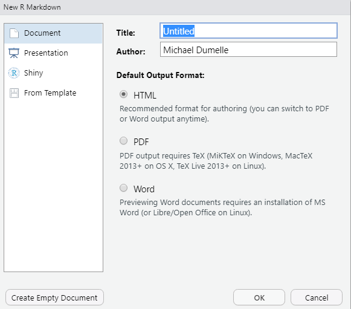
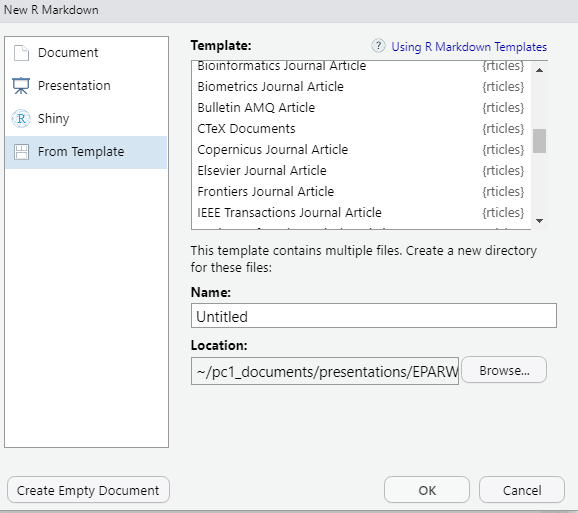

# Extensions {#extensions}

## R Projects

When I first started coding in R, I would try to share my code with others and encountered a problem -- my code would not work on their machine. This is because in my R scripts I would often read in files from different locations on my computer. The paths that point to the objects to read in were specific to my machine. Then when I colleague tried to run my script -- it failed! To get my code to work, they would have edit the file paths to point to the correct objects on their machine. Not only is this a lot to ask of someone, it also makes it incredibly easy to introduce errors. More often than not, I would have to meet with someone to get the code I sent them up and running. This was a waste of time for everyone involved. 

R looks for files to load in a working directory. This is helpful because looking for files in a working directory prevents you from having to type out the full path to a file every time you want to load something. For example, you are not using a working directory and you have several files to load that live in `a/long/path/with/s p a c e s/or/weird/cH-a_r--aCt-er$!!!`. To load `my_cool_file.csv` and `my_other_cool_file.csv`, you have to run
```{r}
read.csv("a/long/path/with/s p a c e s/and/weird/cH-a_r--aCt-er$!!!/my_cool_file.csv")
```

and then retype (or copy/paste) the path to run
```{r}
read.csv("a/long/path/with/s p a c e s/and/weird/cH-a_r--aCt-er$!!!/my_other_cool_file.csv")
```

This workflow is tedious and error-prone. If you set your working directory to `a/really/long/path/with/s p a c e s/or/weird/cH-a_r--aCt-er$!!!`, then to load `my_cool_file.csv` and `my_other_cool_file.csv`, you have to run
```{r}
read.csv("my_cool_file.csv")
read.csv("my_other_cool_file.csv")
```

You can set working directories in R using `setwd()`, but this isn't really a good idea for various reasons (you get to discuss them in the exercises). There is a better way to control your working directory -- insert R projects to the rescue!

R projects automatically set your working directory to live wherever the project is stored on your machine. So if I have `my_cool_file.csv` and `my_other_cool_file.csv` in the root of my R project, I can load them by running
```{r}
read.csv("my_cool_file.csv")
read.csv("my_other_cool_file.csv")
```

while inside the R project. This is so powerful because that means I can bundle up my R project, send it to my colleague, and then the R project will set my colleagues working directory to live wherever they save the project. That means that they can load `my_cool_file.csv` and `my_other_cool_file.csv` using the exact same code I used. No more file path problems -- this is a vastly improved workflow. It may not seem like a huge deal now, but learning how to use R projects can make a huge difference in your ability to share your work.

Another benefit of R projects is that it provides a convenient structure to organize all the files associated with a particular task. To learn more about creating and maintaining R packages, check out [this](https://r4ds.had.co.nz/workflow-projects.html) and [this](https://support.rstudio.com/hc/en-us/articles/200526207-Using-Projects).

### Exercises

1. What are some drawbacks of running `setwd()` whenever you want to set a working directory?

2. Look into the [here](https://here.r-lib.org/) package, designed to help solve working-directory problems (that can even occur within R Projects).

### renv

[renv](https://rstudio.github.io/renv/articles/renv.html) is an R package that brings R package version management to your projects. renv prevents code in your R project from returning separate results based on the version of the R packages installed. It works by saving the specific versions of the R packages in your project and then makes it easy for others to install those same versions before running code in the R project.

## R Markdown

R Markdown documents provide a convenient way to combine text, R code, and results into a fully reproducible document that compiles (knits) to one of several output types (HTLM, PDF, word, slide decks, etc.). An R Markdown document has file extension `.Rmd` and can be created in RStudio by clicking File -> New File -> R Markdown, which brings up the following options
```{r, eval = TRUE, echo = FALSE, out.width = "100%"}

```

Pressing OK automatically opens a file with several contents

````md
---
title: "Untitled"
author: "Michael Dumelle"
date: "9/17/2021"
output: html_document
---

```{r setup, include=FALSE}`r ''`
knitr::opts_chunk$set(echo = TRUE)
```

## R Markdown

This is an R Markdown document. Markdown is a simple formatting syntax for authoring HTML, PDF, and MS Word documents. For more details on using R Markdown see <http://rmarkdown.rstudio.com>.

When you click the **Knit** button a document will be generated that includes both content as well as the output of any embedded R code chunks within the document. You can embed an R code chunk like this:

```{r cars}`r ''`
summary(cars)
```

## Including Plots

You can also embed plots, for example:

```{r pressure, echo=FALSE}`r ''`
plot(pressure)
```

Note that the `echo = FALSE` parameter was added to the code chunk to prevent printing of the R code that generated the plot.
````

The part surrounded by ```---``` is the YAML header, which contains metadata about your document -- big picture options are controlled here.  The parts prefixed by `#` are first-level (section-level) headers, and the parts prefixed by `##` are second level (subsection-level) headers. The parts surrounded by ```` ``` ```` are code chunks -- these are the engine that powers R Markdown. Code chunks let you run and display R code and output in your document. More generally, code chunks look like

````md
```{r label, chunk_options}`r ''`
R code
```
````
The line

```md
knitr::opts_chunk$set()
```
lets you set default options for your code chunks. For example, `knitr::opts_chunk$set(echo = TRUE)` sets `echo = TRUE` for all all code chunks, unless a particular code chunk sets `echo = FALSE`. More information on available code chunk options is [here](https://yihui.org/knitr/options/). Finally, the rest of the document contains the body of the document -- the plain text.
For more on the structure of R Markdown documents, see [this](https://bookdown.org/yihui/rmarkdown-cookbook/conceptual-overview.html).

R Markdown documents are useful for a variety of reasons, two of which we will focus on next. 

1. R Markdown lets you create fully reproducible documents by combining R code and text. There is a slight change to the data? No problem, the tables or figures you are reproduced after changing the data. Suppose you want to knit to a new document style? No problem, just change `output:` This is very powerful.
2. This approach is less error-prone that remaking tables, figures, etc on your own and then inserting them "by hand" into your document.

For much, much more on R Markdown, read [this](https://bookdown.org/yihui/rmarkdown/) and [this](https://bookdown.org/yihui/rmarkdown-cookbook/).

### Exercises

1. Save the basic R Markdown template we just discussed and knit it to see its contents.


## rticles

The rticles is an extension of R Markdown designed to make adhering to journal style requirements easier. Some journal types rticles accommodates are Elsevier, PLOS, Sage, Springer, and Taylor & Francis, among [many more](https://github.com/rstudio/rticles). After installing rticles (`install.packages("rticles")`), you can access article templates by starting a new R Markdown document and selecting the template tab
```{r, eval = TRUE, echo = FALSE, out.width = "100%"}

```

The rticles templates have complicated YAML headers, but they generally have pretty clear inline instructions for how to edit them. The YAML headers change between templates. The body of the document is just standard R Markdown (potentially with some LaTeX). This is so nice because the body of the document is the same across templates (potentially with minor LaTeX discrepancies that are generally explained in the template's inline instructions). Decide you want to switch from an Elsevier journal to a Taylor & Francis journal? No problem, just change the template type! For this reason, rticles is one my favorite R packages.


## Git and GitHub

I highly recommend you learn how to use Git and GitHub. Though intimidating, frustrating, and time-consuming at first, Git and GitHub are well worth the effort. [Git](https://git-scm.com/) is a version control system. A version control system keeps track of all changes made to your code in a Git repository (which is a `.git/` folder somewhere in your code -- note the `.git/` folder is usually hidden). Git is useful on its own, but it benefits greatly from integration with GitHub. [GitHub](https://github.com/) is a website that lets you easily share your code, collaborate with others, track changes to your code, and backup your code, among other features. Git and GitHub is by far the most popular version control system for R packages, and access to development versions of R packages is usually only available through GitHub.
```{r}
devtools::install_github("username/packagename")
```

Though we won't get into details of Git and GitHub here, luckily RStudio has many tools to enable R to communicate with Git and GitHub. For an intro to Git and GitHub through RStudio, visit [here](https://r-pkgs.org/git.html). For a thorough book about using Git and GitHub through RStudio, visit [here](https://happygitwithr.com/). For a video overview of using Git and GitHub through RStudio, watch (here)[https://www.rstudio.com/resources/rstudioconf-2017/happy-git-and-gihub-for-the-user-tutorial/].

## Continuous Integration

Continuous integration (often abbreviated CI) is the process of performing automated checks on code anytime it is updated. This may seem cumbersome, but it is a really good idea so that if an error is inserted in a new version of code, continuous integration helps identify that error. One option for continuous integration in your R package's GitHub repository is [GitHub actions](https://github.com/features/actions). devtools has several tools to help you set up GitHub actions. I recommend using their "standard" GitHub actions template, which can be added to your R project by running

```{r}
use_github_action(name = "check-standard")
```

```{}
√ Creating '.github/'
√ Adding '^\\.github$' to '.Rbuildignore'
√ Adding '*.html' to '.github/.gitignore'
√ Creating '.github/workflows/'
√ Writing '.github/workflows/check-standard.yaml'
* Learn more at <https://github.com/r-lib/actions/blob/master/examples/README.md>
```

You will notice that this code created a new folder at the root of our package named `.github`. The .github folder may be hidden so you may need to enable the viewing of hidden files to look through its contents on your machine (in the files pane of R studio click more and check "show hidden files". Then every time you push to GitHub, GitHub actions will simulate `devtools::check()` on several operating systems and return the results. This setup can be viewed for the RPRW package [here](https://github.com/michaeldumelle/RPRW/actions).  Another option for continuous integration is [Travis CI](https://travis-ci.org/).

## Extra 

[RStudio Cheat Sheets](https://www.rstudio.com/resources/cheatsheets/)