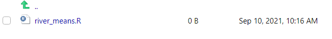
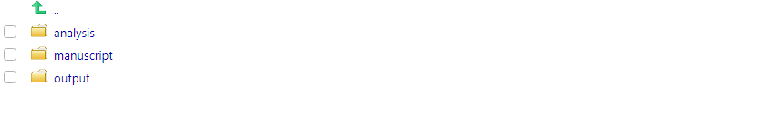

--- 
title: "Using R Packages for Reproducible Workflows"
author: "Michael Dumelle"
date: "September 22, 2021"
site: bookdown::bookdown_site
documentclass: book
bibliography: [book.bib, packages.bib]
# url: your book url like https://bookdown.org/yihui/bookdown
# cover-image: path to the social sharing image like images/cover.jpg
description: |
  This is a minimal example of using the bookdown package to write a book.
  The HTML output format for this example is bookdown::gitbook,
  set in the _output.yml file.
link-citations: yes
github-repo: michaeldumelle/R-Packages-Reproducible-Workflows-Book
---

<!-- build book rmarkdown::render_site(encoding = 'UTF-8') -->

```{r setup, include=FALSE}
knitr::opts_chunk$set(
  echo = TRUE,
  warning = FALSE,
  message = FALSE,
  error = TRUE,
  eval = FALSE,
  comment = "#>",
  collapse = FALSE
)
```

# Welcome {-}

Welcome to the 2021 EPA R Workshop titled "Using R Packages for Reproducible Workflows" by me, Michael Dumelle -- I am glad to have you here! You should have R and RStudio installed before starting this workshop. If not, then just follow along with me as we proceed through the workshop. This workshop book we work through today was published using Bookdown [@xie2016bookdown].

## Schedule {-}

Here is the tentative schedule for today:

* 1:00 - 1:15 EDT: Introductions and [Getting Started]
* 1:15 - 2:45 EDT: [Building an R Package](#r-package)
* 2:45 - 3:05 EDT: Break
* 3:05 - 3:50 EDT: [Making an R Package a Research Compendium](#r-package-rc)
* 3:50 - 4:00 EDT: Break
* 4:00 - 4:30 EDT: [Extensions](#extensions)
* 4:30 - 4:40 EDT: Break
* 4:40 - 5:00 EDT: Questions

We will try to roughly adhere to this schedule, but it is possible that we stray slightly from it -- this is my first time giving the workshop! 

## About Me {-}

I finished my PhD in statistics at Oregon State University in 2020. I now work in ORD-CPHEA-PESD-FEB as a statistician, working primarily on the National Aquatic Resource Surveys (NARS) team. My main research interests are sampling and survey design, spatial statistics, and software development. To learn more about me and my work, visit my [website](https://michaeldumelle.github.io/).

## Acknowledgements {-}

I would like to thank Charlotte Wickham, Hadley Wickham, Jenny Bryan, and Yihui Xie for the immense impact their work has had on my programming journey. Much of this workshop draws from heavily their inspiration. I would also like to thank everyone who helped me hold this workshop.

## Getting Started {-}

The first thing we need to do is install and load the [devtools](https://devtools.r-lib.org/) package
```{r}
install.packages("devtools")
library(devtools)
```

The devtools package contains tools to make developing R packages easier and we will use functions in devtools frequently throughout this workshop. devtools is closely linked to the [usethis](https://usethis.r-lib.org/) package, which is installed alongside devtools. The usethis package contains tools that make package development less tedious and more structured.

In this workshop we will build an R package named RPRW (**R** **P**ackages for **R**eproducible **W**orkflows) designed to quantify properties of rivers in North America. Then we will turn RPRW into a research compendium, a standard by which to organize a body of work. The book that you are viewing interweaves text, R code, and output. You can either follow along throughout the workshop by copying and pasting the R code in this book onto your machine and/or by reading the R code output. The book will be maintained for an indefinite amount of time after the workshop, so feel free to check back in for a refresher whenever you would like! Hyperlinks in this book are in [blue]() and will either take you to another section in the book or an outside webpage.

Though we will build RPRW together, it is available for download in its entirety by running
```{r}
devtools::install_github(repo = "michaeldumelle/RPRW", ref = "main")
```

Then you can load it by running
```{r}
library(RPRW)
```

Now that we have devtools installed and have talked about RPRW, let's get started building this R package!

```{r, eval = TRUE, include = FALSE}
# automatically create a bib database for R packages
knitr::write_bib(c(
  .packages(), 'bookdown', 'knitr', 'rmarkdown', 'devtools'
), 'packages.bib')
```

<!--chapter:end:index.Rmd-->

# Building an R Package {#r-package}

## What is an R Package? {#what-is-an-r-package}

An R package is a collection of code, data, documentation, and tests with a particular structure that can be shared with others. R packages are commonly downloaded from the Comprehensive R Archive Network ([CRAN](https://cran.r-project.org/)). You can install them from CRAN by running
```{r}
install.packages("package_name")
```
load them by running
```{r}
library(package_name)
```
and get help by running
```{r}
?package_name
```

One of the many reasons R packages are so useful is because they are the fundamental vessel by which to share R code. If your code is in a package, others can easily download and use it -- this is the essence of open-source software! Most R users have some experience with using at least one package, so they will likely be familiar with how to use yours after you share it. But sharing code is not the only benefit of creating packages -- a major benefit of using packages is that they enforce your code is built using a certain structure. Adhering to this structure

1. saves you time -- You don't need to think about how to organize your files because packages tell you how these files must be organized!
    * This rigid structure is especially helpful for me -- before I started creating packages my R scripts would be saved in all sorts of locations with no particular organization structure. This made it *very challenging* to come back to my work later and find a particular script.

2. gives you access to a set of standardized tools -- people have created many useful tools that work with R packages, so take advantage of them! 
    * e.g. devtools and usethis

3. forces you to frequently document your work
    * Before I started using R packages, when I would come back my old code, I was convinced someone else wrote it -- I basically had to rewrite it all to understand it. R packages help prevent this.
    
4. guides your research compendium

and

5. can make your research compendium completely reproducible and easy to share
    * This is because packages are built upon R projects (we discuss R projects in more detail in the [R Projects](#r-projects) section. more in the [](#) section)
    * While R projects are not the fundamental focus for today, I highly, highly recommend you use them for every data analysis project that you are not already using an R package for.

### Exercises {#ex-set1}

1. What are some of your favorite R packages?

2. Of those we have talked about so far, what benefits of R packages are most appealing to you?

## Creating an R Package

Next we will create the RPRW package together! If this is your first R package, then an extra special congratulations to you -- this is a big milestone! For those interested in viewing the source code of the RPRW package, visit the GitHub repository [here](https://github.com/michaeldumelle/RPRW).

### The Motivating Dataset

Suppose we want RPRW to summarize the length (in kilometers) and discharge (meters per second cubed) of North American rivers. Suppose we also want RPRW to easily accommodate many subsets of rivers based on their name. Below are our data of interest
```{r, eval = TRUE}
river <- data.frame(
  Missouri = c(3768, 1956),
  Mississippi = c(3544, 18400),
  Yukon = c(3190, 6340),
  Colorado = c(2330, 40),
  Arkansas = c(2322, 1004),
  Columbia = c(2000, 7730),
  Red = c(1811, 852),
  Canadian = c(1458, 174)
) 
rownames(river) <- c("length", "discharge")
river
```

### The First Step {#first-step}

The first step is using devtools to create a package template for us. There are a two ways to easily create this template. First, in the upper left-hand portion of the editor window (upper left-hand pane of RStudio), click "File" -> "New Project" -> "New Directory" -> "R Package" -> "Create Project". An alternative approach is to run
```{r}
devtools::create_package("path_to_RPRW_package/RPRW")
```

```{}
√ Creating 'path_to_RPRW_package/RPRW/'
√ Setting active project to 'path_to_RPRW_package/RPRW'
√ Creating 'R/'
√ Writing 'DESCRIPTION'
Package: RPRW
Title: What the Package Does (One Line, Title Case)
Version: 0.0.0.9000
Authors@R (parsed):
    * First Last <first.last@example.com> [aut, cre] (YOUR-ORCID-ID)
Description: What the package does (one paragraph).
License: `use_mit_license()`, `use_gpl3_license()` or friends to
    pick a license
Encoding: UTF-8
LazyData: true
Roxygen: list(markdown = TRUE)
RoxygenNote: 7.1.1
√ Writing 'NAMESPACE'
√ Writing 'RPRW.Rproj'
√ Adding '^RPRW\\.Rproj$' to '.Rbuildignore'
√ Adding '.Rproj.user' to '.gitignore'
√ Adding '^\\.Rproj\\.user$' to '.Rbuildignore'
√ Opening 'path_to_RPRW_package/RPRW/' in new RStudio session
√ Setting active project to '<no active project>'
√ Setting active project to 'path_to_RPRW_package/RPRW'
```

The package is held inside a folder named "RPRW" created at the the path on your computer named "path_to_RPRW_package". RStudio will automatically create a new window and you will see in the "Files" pane of RStudio (bottom right corner) there are several files (these are located at "path_to_RPRW_package/RPRW")
```{r, eval = TRUE, echo = FALSE, out.width = "100%"}
knitr::include_graphics("images/newrpack_files.PNG")
```

Notice the .Rproj file, which indicates that your package is also a project, so relative paths are used inside the package. Also notice  that the "Environment" pane of RStudio (top right corner) now has a "Build" tab -- this tab contains some useful tools for your R package.

### The First Function {#first-function}

R packages are composed of several functions that work together to accomplish a set of goals. The folder called "R" is where functions in your package live. Let's create our first function, called `river_means()`, which finds the mean river length and discharge of desired rivers. To create an R file in the R folder, run
```{r}
use_r("river_means")
```

You will see some output in the console
```{}
* Modify 'R/river_means.R'
* Call `use_test()` to create a matching test file 
```

and the appropriate file now in your R folder.
```{r, eval = TRUE, echo = FALSE, out.width = "100%"}

```

Generally, the name of your file should match the name of the function, and you should use separate files for separate functions. More experienced users, it is okay to break this rule every once in a while in certain contexts. 

The body of `river_means()` looks like
```{r, eval = TRUE}
river_means <- function(data, pattern) {
  desired_rivers <- grep(pattern, names(data))
  new_data <- data[, desired_rivers]
  rowMeans(new_data)
}
```

There are two arguments in `river_means()`: 

1. `data`: A data frame (whose rows represent length or discharge and whose columns represent rivers)
    * Making `data` the first argument makes this function easily [pipeable](https://r4ds.had.co.nz/pipes.html)
2. `pattern`: A character pattern by which to subset the rivers in `data` before calculating means

There are three lines of code in `river_means()`:

1. Find the variables (rivers) in `data` whose names contain the pattern.
2. Subset `data` to include only the rivers whose names contain the pattern
3. Find the mean length and discharge of the rivers whose names contain the pattern

The object evaluated by the last line of code in a function is returned by default. So `river_means()` returns code evaluated in the third line of `river_means()`. You can force a different object to be returned earlier using `return(object)`.

You can leave comments in your function (by prefixing a line with `#`) to communicate in a non-programming language what your code is doing. This is usually good practice because it helps others (including future you) understand the intent of each line of code.

### `load_all()` {#load-all}

Now that we have written `river_means()` it is natural to want to try it out. One approach is to run `river_means()` (either in the "R/river_means.R" script or by copying and pasting `river_means()` into the console). Another approach is to load `river_means()` by running
```{r}
source("R/river_means.R")
```

These approaches put `river_means()` in the global environment (look at the environment pane in the upper-right hand corner of RStudio). Unfortunately messing around too much in the global environment can easily introduce errors or unintended behavior of your functions.

An alternative approach is to leverage devtools, since after all, you are bothering to create a package, so you may as well use the tools designed for them! The devtools function `load_all()` emulates the process of building, installing, and loading our R package. This has a few benefits. First, the functions are "sourced" into a better spot (not the global environment). Second, it makes all of your functions available through a single line of code -- rather than running and/or sourcing several functions separately. I highly recommend you practice using `load_all()` to load your functions rather than navigating the dangerous global environment. 
```{r}
devtools::load_all()
```

Now we get to try out `river_means()`! Suppose we want to summarize the rivers whose names start with "Mi" (in `river`, this is only Missiouri and Mississippi)?
```{r, eval = TRUE}
river_means(river, "Mi")
```

Next suppose we want to summarize rivers whose names start with "Y" (Yukon) or "R" (Red)?
```{r, eval = TRUE}
river_means(river, "Y|R")
```

Hooray -- our function works! Give yourself a congratulations :)! And for more on patterns and strings in R, visit [here](https://r4ds.had.co.nz/strings.html) and [here](https://bookdown.org/rdpeng/rprogdatascience/regular-expressions.html#sub-and-gsub).

#### Exercises {#ex-set2}

1. How many functions does `river_means()` call within the body of the function? What package are these functions in?

2. Try using `river_means()` with a few different patterns. Do you notice anything strange?

### Creating Package Data {#creating-data}

So far the `river` data has been stored in global environment. What if you want to save this data in an easily accessible location and/or share it with others? Another package development tool to the rescue -- `usethis::use_data()` (are you starting to notice the benefits of the additional tools the package structure provides?). 
```{r}
usethis::use_data(river)
```

```{}
√ Creating 'data/'
√ Saving 'river' to 'data/river.rda'
```

You will see that at the root of your R package (inside "path_to_RPRW_package/RPRW"), there is now a folder called `data`. In `data`, there is a file called `river.rda`. `river_rda` contains the rivers data and can now be loaded by running `data("river")`. For illustration, let's remove rivers from our global environment and then load it using `data("river")` (similar to how we load data from other packages):
```{r}
rm(river) # remove the river data from our global environment
load_all() # emulate the package building, installation, and loading process
data("river") # load the river data
river # view the river data
```

```{r, eval = TRUE, echo = FALSE}
river
```

### roxygen Comments {#roxygen}

After writing `river_means()`, you should document it while its structure is fresh in your mind. This makes it easier for others (including future you) to understand how to use `river_means()`. Documenting R functions is a bit more complicated than leaving standard comments (`#`). Documenting R functions requires the use of a special type of comment -- *roxygen* comments (view the [roxygen2](https://roxygen2.r-lib.org/) package for more). Roxygen comments are prefixed with `#'` (instead of `#` like for standard comments) and have special **tags** associated with them. roxygen comment templates are available and can be inserted by putting your cursor somewhere in the body of a function and either 

1. In the upper-left toolbar, go to Code -> Insert Roxygen Skeleton
2. Press Ctrl/Cmd + Alt + Shift + R

Inserting this roxygen template into `river_means()` yields
```{r}
#' Title
#'
#' @param data 
#' @param pattern 
#'
#' @return
#' @export
#'
#' @examples
river_means <- function(data, pattern) {
  desired_rivers <- grep(pattern, names(data))
  new_data <- data[, desired_rivers]
  rowMeans(new_data)
}
```

The `@` indicates the tag. The template inserts four tags for us: 

1. `@param`: to document function arguments
2. `@return`: to document function output
3. `@export`: to make the function available after installing the package
4. `@examples`: to provide examples of using the function

Let's document `river_means()`
```{r}
#' Means of river lengths and discharges
#'
#' @param data A data frame with two rows. The first row indicates river length and
#'   second row indicates river discharge. The columns of data indicate river names.
#' @param pattern A pattern by which to include only particular rivers
#'
#' @return The mean river length and mean river discharge for the desired rivers
#' @export
#'
#' @examples
#' data("river")
#' river_means(river, pattern = "Mi")
river_means <- function(data, pattern) {
  desired_rivers <- grep(pattern, names(data))
  new_data <- data[, desired_rivers]
  rowMeans(new_data)
}
```

Next we need to turn these roxygen comments into a new format that packages require before finishing documentation. The details of this new format are not critical -- the important take-away is that the roxygen comments are automatically transformed to the new format by running
```{r}
devtools::document()
```

```{}
i Updating RPRW documentation
i Loading RPRW
Writing NAMESPACE
Writing river_means.Rd
```

From now on I'll stop reminding you every time, but again, notice the benefits of leveraging tools that use the package structure. `devtools::document()` creates a new folder at the root of the package called `man` that now contains a file called `river_means.md`
```{r, eval = TRUE, echo = FALSE, out.width = "100%"}
knitr::include_graphics("images/newrpack_files2.PNG")
```

The `river_means.md` file is the result of transforming the roxygen comments to documentation that packages use. As you can see, `river_means.md` is a bit more complicated than the roxygen comments in `river_means()`. Luckily, `river_means.md` is automatically generated. The broader, important point of all this is that after running `devtools::document()`, you can view the documentation of `river_means()`! 
```{r}
?river_means
```

```{r, eval = TRUE, echo = FALSE, out.width = "100%"}
knitr::include_graphics("images/newrpack_example.PNG")
```

For more on documentation in R packages (including documenting data), visit [here](https://r-pkgs.org/man.html#man) and the vignettes [here](https://cran.r-project.org/web/packages/roxygen2/index.html). Though we skip documenting the river data here, the RPRW package available from GitHub does document it (the documentation can be viewed by running `?rivers` after `library(RPRW)`).

### The Second Function {#second-function}

You may be wondering how to tell your package to use functions from other packages. `river_means()`uses a few other functions available in R (see [Exercise 1.1.1.1](#ex-set1): `<-`, `grep()`, `names()`, `[`, and `rowMeans()`. How does R know how to use the right `names()` function when executing `river_means()`? These questions related to an package's [NAMESPACE](#namespace), which we discuss a bit later.

The functions used in `river_means()` are all from the [base](https://stat.ethz.ch/R-manual/R-devel/library/base/html/00Index.html) package in R (the base package is automatically installed alongside R). When using base functions in your R package, you don't have to give R any special warning. This is the only package that operates this way, however. When using functions from other packages in your package, you need to let R know what package that function comes from (this is true even for other packages automatically installed alongside R - stats, graphics, grDevices, utils, datasets, and methods). To illustrate this process, suppose we want to create a new function in our package called `river_medians()` that operates like `river_means()` but computes medians instead of means. First we create the script in our R folder by running
```{r}
use_r("river_medians")
```

Then we can write `river_medians()` (there is no `rowMedians()` function so we need to use `apply()` to summarize across rows -- see `?apply` for more detail):
```{r}
river_medians <- function(data, pattern) {
  desired_rivers <- grep(pattern, names(data))
  new_data <- data[, desired_rivers]
  apply(new_data, 1, median)
}
```

But wait! Run
```{r}
?median
```

See anything different? You'll notice that `median()` is in the [stats](https://stat.ethz.ch/R-manual/R-devel/library/stats/html/00Index.html) package, not the base package. We need to let R know that when `river_medians()` uses `median()`, the appropriate `median()` is from the stats package. To accomplish this, there are two steps to take. 

The first step is to tell your package that somewhere, your package requires at least one function in the stats package by running
```{r}
usethis::use_package("stats")
```

```{}
√ Adding 'stats' to Imports field in DESCRIPTION
* Refer to functions with `stats::fun()`
```

The package stats was added to the Imports field in the [DESCRIPTION](#description) file at the root of your package. We will talk more about DESCRIPTION in a bit, but for now just remember that it contains metadata (high-level data) about your package. No matter how many times your package uses any function from stats, you only need to run `usethis::use_package("stats")` once.  

The second step is to tell `river_medians()` function to use the `median()` from stats. There are a few ways to do this. The way that is considered best practice is to preface any outside functions (aside from those in base) with `packagename::`. Incorporating this into `river_medians()` and inserting roxygen documentation yields
```{r}
#' Medians of river lengths and discharges
#'
#' @param data A data frame with two rows. The first row indicates river length and
#'   second row indicates river discharge. The columns of data indicate river names.
#' @param pattern A pattern by which to include only particular rivers
#'
#' @return The median river length and mean river discharge for the desired rivers
#' @export
#'
#' @examples
#' data("river")
#' river_medians(river, pattern = "Mi")
river_medians <- function(data, pattern) {
  desired_rivers <- grep(pattern, names(data))
  new_data <- data[, desired_rivers]
  apply(new_data, 1, stats::median)
}
```

Though this is way that is considered best practice, it does add some extra typing and can be cumbersome if you are using many outside functions. The `packagename::` prefix can be avoided by importing `median()` from stats to `river_median()` using the roxygen tag `@importFrom`:
```{r}
#' Medians of river lengths and discharges
#'
#' @param data A data frame with two rows. The first row indicates river length and
#'   second row indicates river discharge. The columns of data indicate river names.
#' @param pattern A pattern by which to include only particular rivers
#'
#' @return The median river length and mean river discharge for the desired rivers
#' @importFrom stats median
#' @export
#'
#' @examples
#' data("river")
#' river_medians(river, pattern = "Mi")
river_medians <- function(data, pattern) {
  desired_rivers <- grep(pattern, names(data))
  new_data <- data[, desired_rivers]
  apply(new_data, 1, median)
}
```

A third option is relevant if you are using several functions from stats. In this case, it may be easier to use the `@import` tag, which imports all functions from stats to `river_median()`.
```{r}
#' Medians of river lengths and discharges
#'
#' @param data A data frame with two rows. The first row indicates river length and
#'   second row indicates river discharge. The columns of data indicate river names.
#' @param pattern A pattern by which to include only particular rivers
#'
#' @return The median river length and mean river discharge for the desired rivers
#' @import stats
#' @export
#'
#' @examples
#' data("rivers")
#' river_medians(rivers, pattern = "Mi")
river_medians <- function(data, pattern) {
  desired_rivers <- grep(pattern, names(data))
  new_data <- data[, desired_rivers]
  apply(new_data, 1, median)
}
```

Be careful when using `@importFrom` or `@import`. If two functions from different packages have the same name and you try to use it in your function, R may not know which one to use. In these contexts, using the `packagename::` prefix is crucial.

#### Exercises {#ex-set3}

These exercises are challenging, so if they don't make sense now, that is okay! Make sure to re-review the solutions after the workshop.

1. Write a new function, `river_stats()`, that takes a data frame, pattern, and a general function by which to summarize river length and discharge. This general function should not be an actual function but rather a placeholder for a function a user inserts themselves.

2. Rewrite `river_stats()` from the previous exercise so that `river_stats()` also takes additional arguments to the summarizing function (hint: use `...` as an argument)

### DESCRIPTION {#description}

The DESCRIPTION file contains the R package's metadata (and was automatically installed when we created the R package). The DESCRIPTION file lets you easily track version numbers, authorship, and additional R packages that your R package uses. There are two fields in DESCRIPTION that do most of the communication regarding how your R package uses additional R packages:

1. Imports: Packages here must be installed in order for your package to work. As a result, any package listed in `Imports` will be installed alongside your package. Packages in `Imports` help build the foundation of your package.

2. Suggests: Packages here enhance your package but are not required for your package to work. You might use suggested packages for enhanced plotting, additional data sets, or more. Packages in `Suggests` can add finishing touches to your package, but they are not part of your package's foundation.

Other fields used to communicate how your R package uses additional R packages are `Depends`, `LinkingTo`, and `Enhances`. The difference between `Depends` and `Imports` is subtle -- the general advice is to use `Imports` instead of `Depends`.

Editing the package, title, author, and description fields of this package yield a DESCRIPTION file that looks like
```{}
Package: RPRW
Title: R Packages for Reproducible Workflows
Version: 0.0.0.9000
Authors@R: 
    person(given = "Michael",
           family = "Dumelle",
           role = c("aut", "cre"),
           email = "Dumelle.Michael@epa.gov")
Description: A companion R package for "Using R Packages for Reproducible Workflows"
    at the 2021 EPA R Workshop.
License: `use_mit_license()`, `use_gpl3_license()` or friends to pick a
    license
Encoding: UTF-8
LazyData: true
Roxygen: list(markdown = TRUE)
RoxygenNote: 7.1.1
Depends: 
    R (>= 2.10)
Imports: 
    stats
```

We will talk about some of the remaining parts of DESCRIPTION later.

### NAMESPACE {#namespace}

While the DESCRIPTION file communicates what packages your package *uses*, the NAMESPACE file communicates *how* your package uses these packages. More specifically, the NAMESPACE file controls which functions your package exports (making them available to others when your package in installed) and what functions from what packages must be available for your exported functions to work. The DESCRIPTION file is automatically updated while running `devtools::document()` and should not be edited by hand (in fact, there is a warning in the NAMESPACE file to warn against editing the file by hand)

In `river_median()`, if you called `median` using `stats::median`, your NAMESPACE file will look like
```{r}
# Generated by roxygen2: do not edit by hand

export(river_means)
export(river_medians)
```

If you used the `@importFrom stats median` approach, your NAMESPACE will look like
```{r}
# Generated by roxygen2: do not edit by hand

export(river_means)
export(river_medians)
importFrom(stats,median)
```

If you used the `@import stats` approach, your NAMESPACE will look like
```{r}
# Generated by roxygen2: do not edit by hand

export(river_means)
export(river_medians)
import(stats)
```

### testthat {#testthat}

Testing your code to make sure that it performs as intended is an important step in the package building process. Though this may seem like extra work, implementing a rigorous testing procedure for your package will provide several benefits: [fewer bugs, better code structure, easier restarts, and robust code](https://r-pkgs.org/tests.html). In R, testing is incorporated into your package through the [testthat](https://testthat.r-lib.org/) package. To begin using testthat, run
```{r}
usethis::use_testthat()
```

```{}
√ Adding 'testthat' to Suggests field in DESCRIPTION
√ Setting Config/testthat/edition field in DESCRIPTION to '3'
√ Creating 'tests/testthat/'
√ Writing 'tests/testthat.R'
```

The root of your package directory should look like
```{r, eval = TRUE, echo = FALSE, out.width = "100%"}
knitr::include_graphics("images/newrpack_files3.PNG")
```

The tests folder should look like
```{r, eval = TRUE, echo = FALSE, out.width = "100%"}
knitr::include_graphics("images/newrpack_files4.PNG")
```

Tests are generally written on a function-by-function basis. Tests for a function should be contained in an R script titled `test-function_name`. Luckily, `usethis::use_test()` creates an R script for you with the proper name! To start testing `river_means()`, run
```{r}
usethis::use_test("river_means")
```

```{}
√ Writing 'tests/testthat/test-river_means.R'
* Modify 'tests/testthat/test-river_means.R'
```

Your `testthat` folder should look like
```{r, eval = TRUE, echo = FALSE, out.width = "100%"}
knitr::include_graphics("images/newrpack_files5.PNG")
```

Tests can be fairly detailed and cover many components of a function (such as input types, output types, function output, etc.). The tests in testthat are prefixed with `expect_`. Here we write a simple test that calculates whether our function, `river_means()`, yields output that we would expect if we calculated the means "by hand":
```{r, eval = TRUE}
testthat::test_that("the mean length is calculated correctly in a test case", {
  
  # calculate values required for the test for length

  ## calculate the means from the function
  river_means_val <- river_means(river, "Missouri|Mississippi")
  river_means_length <- river_means_val[[1]]

  ## calculate the means "by hand"
  raw_vec_length <- unlist(river["length", c("Missouri", "Mississippi")])
  raw_means_length <- mean(raw_vec_length)
  
  # perform the actual test for length

  ## check that the function and "by hand" output matches
  expect_equal(river_means_length, raw_means_length)
})
```

If you have many tests, the `devtools::test()` function runs all of the tests in the `testthat` folder:
```{r}
devtools::test()
```

```{}
i Loading RPRW
i Testing RPRW
√ |  OK F W S | Context
√ |   1       | river_means                                                     
                                               
== Results =========================================================================
[ FAIL 0 | WARN 0 | SKIP 0 | PASS 1 ]
```

We can write a similar test for discharge and then repeat the process for `river_meadians()`. Then `devtools::test()` returns
```{r}
devtools::test()
```

```{}
i Loading RPRW
i Testing RPRW
√ |  OK F W S | Context
√ |   2       | river_means                                                         
√ |   2       | river_medians                                                       

== Results =========================================================================
[ FAIL 0 | WARN 0 | SKIP 0 | PASS 4 ]
```

All tests pass -- hooray! I want to again emphasize how important testing is. I know that it seems like an extra chore, but in my experience, writing careful tests has always paid off...with interest.

#### Exercises {#ex-set4}

1. Write similar tests for `river_means()` (discharge), `river_medians()` (length), and `river_medians()` (discharge).

### License {#license}

At some point, your package needs a license. The license places restrictions on how your package can be shared with others. Licensing can be rather technical and complicated, so I refer you [here](https://r-pkgs.org/license.html) for more information. For illustration purposes, we will use a GPL-3 license for this package: 
```{r}
usethis::use_gpl_license()
```

```{}
√ Setting License field in DESCRIPTION to 'GPL (>= 3)'
√ Writing 'LICENSE.md'
√ Adding '^LICENSE\\.md$' to '.Rbuildignore'
```

`usethis::use_gpl_license()` adds the license to DESCRIPTION and creates a LICENSE.md file at the root of your package that contains information about the license. 

### Vignettes {#vignettes}

Vignettes act as high-level user guides for your package. They are the glue that binds together several components of your package to illustrate how the package can be used to solve a particular problem. Vignettes tend to be [R Markdown]{#rmarkdown} documents. Though we cover R Markdown documents in more detail later, for now we note that they that dynamically interweave text and R code to form the foundation for fully reproducible documents created in R. R markdown documents have a `.Rmd` extension.

The [ggplot2](https://ggplot2.tidyverse.org/) package is a popular package for visualizing data. After installing ggplot2
```{r}
install.packages("ggplot2")
```
you can view its available vignettes by running
```{r}
vignette(package = "ggplot2")
```

after which a file will pop up alongside your R scripts with the contents
```{r, eval = TRUE, echo = FALSE, out.width = "100%"}
knitr::include_graphics("images/newrpack_files6.PNG")
```

To then  view a specific vignette, run `vignette(topic, package)`. For example, to view the vignette regarding **aes**thetic specifications, run
```{r}
vignette("ggplot2-specs", "ggplot2")
```

The vignette can be viewed in the bottom-right pane of RStudio. Vignettes are also available on a package's CRAN page -- for the ggplot2 aesthetic specifications vignette, see [here](https://cran.r-project.org/web/packages/ggplot2/vignettes/ggplot2-specs.html).

Suppose we want to include a vignette that shows how to use RPRW to compute river statistics. Running
```{r}
use_vignette("river-statistics", "River Statistics")
```

```{}
√ Adding 'knitr' to Suggests field in DESCRIPTION
√ Setting VignetteBuilder field in DESCRIPTION to 'knitr'
√ Adding 'inst/doc' to '.gitignore'
√ Creating 'vignettes/'
√ Adding '*.html', '*.R' to 'vignettes/.gitignore'
√ Adding 'rmarkdown' to Suggests field in DESCRIPTION
√ Writing 'vignettes/river-statistics.Rmd'
* Modify 'vignettes/river-statistics.Rmd'
```

does a few things. It alters your DESCRIPTION file, most notably adding the [knitr](https://yihui.org/knitr/) and rmarkdown packages to the `Suggests` field.  It also creates a vignette folder at the root of your package and adds to that folder an rmarkdown vignette (notice the `.Rmd` extension) named `river-statistics.Rmd` whose title is "River Statistics".

While we won't create a vignette for our package during the workshop, I have added a vignette to the RPRW package. To view it (after installation), run
```{r}
vignette(river-statistics, "RPRW")
```

### `devtools::check()` {#check}

At this point we have built R package and are ready to share it with the world! But we should probably check to make sure we did not make any small mistakes. Does devtools have a way to do this? Of course -- introducing `devtools::check()`! `devtools::check()` evaluates several automated tests on your package to make sure it can be properly installed and shared  -- this can take a few minutes. The `devtools::check()` output lists errors, warnings, and notes associated with your package. Though the warnings and notes are important, it is most crucial to address the errors immediately. 

Hopefully your output after running `devtools::check()`, your output looks like
```{}
-- R CMD check results ---------- RPRW 0.0.0.9000 ----
Duration: 34.4s

0 errors √ | 0 warnings √ | 0 notes √
```

If not, do your best to fix the errors and address the warnings and notes!

### `devtools::install()` {#install}

After `devtools::check()` identifies zero errors (and hopefully zero warnings and notes), you can install your package by running
```{r}
devtools::install()
```

After installing RPRW, you can use `library(RPRW)` to load it like you do any other R package.

#### Exercises {#ex-set5}

1. Find the argument to `devtools::install()` that identifies whether vignettes are built alongside installation. What is the default value of this argument?

### Congratulations {#congratulations}

Congratulations on building an R package! If this was your first one, then an extra special congratulations to you! Hopefully stepping through the process together made it all less intimidating.

```{r, eval = TRUE, echo = FALSE, out.width = "50%"}
knitr::include_graphics("images/you_did_it.jpg")
```

## Debugging {#debugging}

Even the best of programmers write code that may fail in unintended ways. This unintended failing of code is referred to as a "bug," and the process of fixing the "bug" is known as "debugging". Don't expect to always write perfect code -- do expect to have the tools necessary to track down bugs and remedy them. Though we went through a rigorous documentation and testing procedure when creating `river_means()` and `river_medians()`, there are still bugs present in these functions.

### A Mysterious Error Message {#error-onematch}

We have already used `river_means()` and `river_medians()` to successfully find means and medians for several patterns. But running `river_means(river, "R")` yields a mystifying error:
```{r, eval = TRUE}
river_means(river, "R")
```

Something is wrong -- and we need to figure out what. A good first step is to copy and paste the error into a Google search engine and see if anyone has solved the problem yet. If you are lucky, this approach will identify the bug for you. If you are not so lucky, you need to try a different approach. Fortunately, R has built-in tools that can help you track down bugs -- we will explore a few of these tools next.

### `traceback()` {#traceback}

The `traceback()` function is generally run in the console after receiving an error. `traceback()` identifies where the error occured in the previous function call. Here we run `traceback()` after `river_means(river, "R"):
```{r}
traceback()
```

```{}
3: stop("'x' must be an array of at least two dimensions")
2: rowMeans(new_data) at #4
1: river_means(rivers, "R")
```

We now know that the error occurs in Line 4 of `river_means()` (the `rowMeans(new_data)` step). While this is very useful information, we still don't know exactky why the error occurs.

### `browser()` {#browser}

In my early stages of debugging, I would save my arguments to a function in the global environment and then run through each line of the function returning the error, effectively "recreating" the environment in which the error occurred. Perhaps some of you have done this too. The bad news is that this approach is often error-prone and inefficient. The good news is that there is a better way -- `browser()`. Inserting `browser()` into your code and then running it lets you interactively step into the function, starting at wherever `browser()` is located. No more saving arguments to the global environment and running code line-by-line! Let's try this out with `river_means()`:

```{r}
river_means <- function(data, pattern) {
  browser()
  desired_rivers <- grep(pattern, names(data))
  new_data <- data[, desired_rivers]
  rowMeans(new_data)
}
```

After using `devtools::load_all()` and running `river_means()`, you will step into the function before the first line of code. For example,
```{r}
river_means(river, "R")
```

opens a new file in the editor (upper left-hand) window that looks like
```{r, eval = TRUE, echo = FALSE, out.width = "75%"}
knitr::include_graphics("images/newrpack_files7.PNG")
```

You will also see a few buttons in the R console (lower left-hand) window:
```{r, eval = TRUE, echo = FALSE, out.width = "75%"}
knitr::include_graphics("images/newrpack_files8.PNG")
```

These five buttons help you interactively navigate through `river_means()`. From left to right, they are

* Next (`n`), which executes the next line of the code
* Step (`s`), which steps into the function called by the current line of code
* Finish (`f`), which finishes execution of the current function
* Continue (`c`), which leaves the interactive context and continues execution of the function
* Stop (`Q`), which leaves the interactive context and terminates execution of the function

Before navigating through any lines of `river_means()`, we see `data` and `pattern` are defined:
```{r, eval = TRUE, echo = FALSE}
data <- river
pattern <- "R"
```

```{r, eval = TRUE}
print(data)
print(pattern)
```

Pressing `n` (Next) executes `browser()`. Pressing `n` (Next) again executes
```{r, eval = TRUE}
desired_rivers <- grep(pattern, names(data))
```

Inspecting `desired_rivers`, we see
```{r, eval = TRUE}
print(desired_rivers)
```

This seems correct, as the seventh river, "Red", does match the pattern "R". So the error isn't here. Let's press `n` (Next) to evaluate the next line
```{r, eval = TRUE}
new_data <- data[, desired_rivers]
```

Inspecting `new_data`, we see
```{r, eval = TRUE}
new_data
```

Well this seems weird -- `new_data` does not look like a data frame. Let's inspect the structure
```{r, eval = TRUE}
str(new_data)
```

`new_data` is in fact not a data frame, but rather it is a numeric vector. Because `rowMeans()` requires an array of two or more dimensions (e.g. a matrix or data frame), the next line of code, `rowMeans()`, fails. Pressing `n` again returns the error and removes you from the interactive mode:
```{r, eval = TRUE}
rowMeans(new_data)
```

This is a good example of one of the reasons debugging can be so challenging: often, an error occurs because code from a few lines back runs in an unintended way (even though it runs successfully). Note that a similar error occurs when running `river_medians(river, "R")` because `apply()` requires an array of two or more dimensions.

So what is happening here? We know the code works when the pattern yields at least two matches in `river`. But now, with one match, the code is failing. Let's start with the `[` function called by `data[, desired_rivers]`, where we receive unintended output. Let's look at the documentation of `[` by running
```{r}
?`[`
```

A close look at the documentation reveals further documentation for the behavior of `[` when applied to a data frame
```{r}
?`[.data.frame`
```


Notice the `drop` argument in this documentation. The `drop` argument, when `TRUE`, coerces the object to the lowest possible dimension. When subsetting a data frame by one column, `drop` is `TRUE`  by default and data frame structure is turned into a vector structure, which only has one dimension -- this is why the error is occurring. So we need to force our subsetting to always keep the data frame structure by setting `drop = FALSE`. Accommodating this change in `river_means()` and `river_medians()` yields functions that look like
```{r, eval = TRUE}
river_means <- function(data, pattern) {
  desired_rivers <- grep(pattern, names(data))
  new_data <- data[, desired_rivers, drop = FALSE]
  rowMeans(new_data)
}

river_medians <- function(data, pattern) {
  desired_rivers <- grep(pattern, names(data))
  new_data <- data[, desired_rivers, drop = FALSE]
  apply(new_data, 1, median)
}
```

Now running `river_means()` and `river_medians()` with patterns only having one match behaves as intended
```{r, eval = TRUE}
river_means(river, "R")
river_medians(river, "R")
```

For more information about debugging in R, watch [this](https://www.youtube.com/watch?v=vgYS-F8opgE) or read [this](https://adv-r.hadley.nz/debugging.html).

### Another Error -- No Mysterious Message {#error-zeromatch}

We previously received and fixed an error message that occurred when the pattern only matched one river. So we know our code works when the pattern matches at least one river. But what happens when the pattern matches zero rivers?
```{r, eval = TRUE}
river_means(river, "ZZZ")
```

The length and discharge means are `NaN`, which stands for "Not a Number" -- this is certainly unintended (note that `river_medians(river, "ZZZ")` returns similar output.). These types of bugs are especially pernicious because there is no error message associated with them -- we can't use `traceback()`. Say `river_means()` was a small part of a much larger function, -- this bug could be the root of a confusing error several lines later. Whenever function output is unexpected and you can't immediately figure out why, use `browser()` to diagnose the bug. In this context, `desired_rivers` is a length-zero vector, which causes problems in the remaining parts of the function. To guard against these types of bugs, identify potentially problematic scenarios for your function and program defensively, forcing the function to return an informative error message when a problematic scenario is identified. Here we force `river_means()` to return an error message when the pattern matches zero rivers:
```{r, eval = TRUE}
river_means <- function(data, pattern) {
  desired_rivers <- grep(pattern, names(data))
  if (length(desired_rivers) == 0) {
    stop("This is an error message that stops the function.")
  }
  new_data <- data[, desired_rivers, drop = FALSE]
  rowMeans(new_data)
}
river_means(rivers, "ZZZ")
```

#### Exercises {#ex-set6}

1. Rewrite `river_medians()` so that it stops and returns an informative error message when the pattern matches zero rivers.

## Additional Resources {#add-resources}

* [R Packages](https://r-pkgs.org/index.html) by [Hadley Wickham](http://hadley.nz/) and [Jenny Bryan](https://jennybryan.org/) [@wickham2015r]
* [Writing an R package from scratch](https://hilaryparker.com/2014/04/29/writing-an-r-package-from-scratch/) by [Hilary Parker](https://hilaryparker.com/)
* [Writing R Extensions](https://cran.r-project.org/doc/manuals/r-release/R-exts.html) by CRAN (this resource is very technical)

<!--chapter:end:01-r-package.Rmd-->

# Making an R Package a Research Compendium {#r-package-rc}

## What is a Research Compendium? {#what-is-a-rc}

@marwick2018packaging state that the goal of a research compendium is to provide a standard and easily recognizable way to organize the digital materials of a project to enable others to inspect, reproduce, and extend the work. Three generic principles define a research compendium:

1. Files should be organized according to the prevailing conventions of a broader community. This helps members of the community recognize the structure of the project and make tools that utilize the structure.

2. There should be a clear separation of data, methods, and output. For example, raw data should be kept separate from the code that cleans the data so that others can access the raw data.

3. The computational environment for the methods should be clearly specified. At the most basic level, this means recording the names and version numbers of software. At the most detailed level, this means completely reproducing the computing environment.

### Exercises {#ex-set7}

1. What principles of a research compendium seem most beneficial to you?

## Why a Research Compendium? {#why-a-rc}

@marwick2018packaging (and references therein) give several benefits of a research compendium:

* A convenient way to publicly share data and code
* Work with publicly available data sets may receive higher numbers of citations than work with private data sets (note that publicly available data sets also tend to be easier to clear through EPA platforms)
* Data sharing is associated with higher publication productivity
    * Of 7,040 NSF and NIH awards studied, the median number of publications associated with each research grant was five when the data were private and 10 when the data were public
* Structured and simplified file management and workflows
* More defense against errors
* Easier to communicate with others (and future you)

### Exercises {#ex-set8}

1. Can you identify any benefits to a research compendium that are not already on this list?

## Why an R Package for a Research Compendium? {#why-r-pack-for-rc}

As previously mentioned, a research compendium requires a specific structure. Earlier in this workshop, we got some experience with something in R that also requires a specific structure............R packages! A research compendium can significantly benefit from adopting the structure of an R package. Organization is simpler (as you already have a structure), writing and documenting functions and data helps guard against errors in an analysis, and devtools and usethis have several development tools to help ensure your R package performs as intended. 

We have previously discussed how to include data in an R package, but many of you may be wondering how we include additional pieces of a research compendium like analysis scripts, output, or a manuscript itself. If the structure of an R package is so rigid -- how do these pieces fit? We discuss one such approach next.

## Turning RPRW Into A Research Compendium {#rprw-to-rc}

If a folder named `inst` is placed at the root of an R package's directory, all of the raw contents in `inst` will be installed upon installation of the R package. This is where we can put the pieces of our research compendium that are not explicitly related to the previous implementation of our R package. We can use this approach to turn RPRW into a research compendium.

Suppose we are using RPRW to supplement a manuscript about rivers. Let's first add the `inst` folder -- the root of your package's directory should look similar to 
```{r, eval = TRUE, echo = FALSE, out.width = "100%"}
knitr::include_graphics("images/newrpack_files9.PNG")
```

Let's add three folders to `inst`:

1. `analysis` for our analysis scripts -- these scripts contain code that is not related to the functions in the package but is related to other parts of the research compendium (e.g. generating output for the manuscript)
2. `output` for our analysis output
3. `manuscript` for our manuscript
```{r, eval = TRUE, echo = FALSE, out.width = "100%"}

```

Suppose we plan to use this research compendium to write a manuscript on summarizing rivers. First we will make an R script to put in `analysis`. Recall that in [Exercise 1.2.7.1.2](#ex-set3), we generated `river_stats()`, whose body look like
```{r}
river_stats <- function(data, pattern, FUN, ...) {
  desired_rivers <- grep(pattern, names(data))
  new_data <- data[, desired_rivers]
  apply(new_data, 1, FUN, ...)
}
```

`river_stats()` works like `river_means()` and `river_medians()` but takes a general function instead of computing the mean or median specifically. Our script to put in `analysis` will look like
```{r}
# find some summary statistics on rivers with pattern "C"

## load RPRW -- we need to do this because the script is separate from the 
## functions installed in the RPRW package
library(RPRW) 

## find minimums
river_min <- river_stats(river, "C", min)

min_df <- data.frame(
  data = "river",
  pattern = "C",
  length_min = river_min[[1]],
  discharge_min = river_min[[2]]
)

write.csv(min_df, "inst/output/min_df", row.names = FALSE)
```

This R loads RPRW and finds the minimum length and discharge for rivers whose names start with C. The script then saves the contents to a CSV file in the `output` folder. These contents are used when building the manuscript. The manuscript is in the `manuscript` folder and is a completely reproducible R Markdown document. Though we won't discuss the details of this R Markdown document here unless we have time, the files can be viewed on your machine (after installing RPRW) at the location provided by
```{r}
system.file("manuscript", package = "RPRW")
```

A compiled PDF of the manuscript is available [here](https://github.com/michaeldumelle/RPRW/blob/main/inst/manuscript/manuscript.pdf). 

### Exercises {#ex-set9}

1. There is a folder name within `inst` that should be avoided -- what is it?

### Adding a Citation {#citation}

Often times your research compendium may be centered around a particular publication. You may build an R package that deals with specific tasks and then write your manuscript using the research compendium structure. In this event, you may want your publication to be easily citeable. You can add a citation to your R package research compendium by running
```{r}
use_citation()
```

```{}
√ Writing 'inst/CITATION'
* Modify 'inst/CITATION'
```

The citation file is placed in the `inst` folder. It looks a little intimidating at first, but it automatically creates a text version and LaTeX version of your citation with relatively little ease. Here is raw code I used to create the citation in the RPRW package
```{r}
citHeader("To cite RPRW in publications use:")

citEntry(
  entry    = "Manual",
  title    = "Using R Packages for Reproducible Workflows",
  author   = personList(as.person("Michael Dumelle")),
  journal  = "EPA 2021 R Workshop",
  url      = "https://github.com/michaeldumelle/R-Packages-Reproducible-Workflows-Book",
  textVersion =
  paste(
    "Michael Dumelle.",
    "(2021).",
    "Using R Packages for Reproducible Workflows.",
    "EPA 2021 R Workshop.",
    "URL https://github.com/michaeldumelle/R-Packages-Reproducible-Workflows-Book."
  )
)
```

To view the citation, run
```{r, eval = TRUE}
citation(package = "RPRW")
```

If left unedited, the package citation defaults to something that looks like
```{}
 
 To cite package 'RPRW' in publications use:
 
   Michael Dumelle (2021). RPRW: R Packages for Reproducible Workflows.
   R package version 0.0.0.9000.
 
 A BibTeX entry for LaTeX users is
 
   @Manual{,
     title = {RPRW: R Packages for Reproducible Workflows},
     author = {Michael Dumelle},
     year = {2021},
     note = {R package version 0.0.0.9000},
   }
```

## Research Compendium Recap {#rc-recap}

The research compendium now visibly contains:

* `data`: a folder containing data
* `DESCRIPTION`: a file containing metadata about our package
* `inst`: a folder containing auxiliary files to be downloaded alongside the package's installation
    * `analysis`: a folder containing R scripts that are separate from the R package but used as part of the research compendium
    * `CITATION`: a file containing citation information
    * `manuscript`: a file containing the manuscript and auxiliary files
    * `output`: a file containing the CSV output
* `LICENSE.md`: a file containing metadata about our license (GPL-3)
* `man`: a folder containing R function documentation from the package
* `NAMESPACE`: a file containing exports and imports
* `R`: a folder containing R functions from the package
* `RPRW.Rproj`: a file containing R Project metadata
* `tests`: a folder containing R function testing
* `vignettes`: a folder containing the package vignette

You can also add a `README.md` file to give a broad overview of your package (`README.md` is useful whether or not you use Git and GitHub). The `README.md` file is a [markdown](https://www.markdownguide.org/) file (notice the .md extension and notice the connection between R Markdown (`.Rmd`) and Markdown (`.md`)) in the RPRW package that looks like
```{}
# RPRW
Companion R package for "Using R Packages for Reproducible Workflows" at the 2021 EPA R Workshop

```

## Sharing Your Research Compendium {#sharing-rc}

So now you have a research compendium that combines your R functions with your data, code, and manuscript to create a reproducible product that is easy to share with your colleagues. But how do we share it? Running
```{r}
devtools::build()
```

will build an R package for you. By default, the package will be located in the same folder as the folder containing your R package with name "package-name_version-number.tar.gz". Note that this is one level above the location of your R package's directory. For example, if folder "A" holds "RPRW", which is the folder containing all of the files associated with my R package, then using `devtools::build()` will install "RPRW_0.0.0.9000.tar.gz" in folder "A". 

After building the package, you can send it to a colleague, they can save it on their machine, and then they can install it by running
```{r}
install.packages(path_to_package, repos = NULL, type = "source")
```

If your colleague doesn't remember where they saved the file, they can interactively search for it by running
```{r}
install.packages(file.choose(), repos = NULL, type = "source")
```

Because R packages leverage R projects, all file paths are relative (not absolute), and your colleague can immediately run any of your code on their machine!

### Exercises {#ex-set10}

1. Run `?devtools::build` to look at some additional arguments -- which seem useful to you?

## An Example R Package Reserach Compendium {#ex-rc}

A recent publication of mine used this R package research compendium structure -- you can view the GitHub repository [here](https://github.com/michaeldumelle/DumelleEtAl2021STLMM).

<!--chapter:end:02-a-research-compendium.Rmd-->

# Extensions {#extensions}

## R Projects {#r-projects}

When I first started coding in R, I would try to share my code with others and encountered a problem -- my code would not work on their machine. This is because in my R scripts I would often read in files from different locations on my computer. The paths that point to the objects to read in were specific to my machine. Then when I colleague tried to run my script -- it failed! To get my code to work, they would have edit the file paths to point to the correct objects on their machine. Not only is this a lot to ask of someone, it also makes it incredibly easy to introduce errors. More often than not, I would have to meet with someone to get the code I sent them up and running. This was a waste of time for everyone involved. 

R looks for files to load in a working directory. This is helpful because looking for files in a working directory prevents you from having to type out the full path to a file every time you want to load something. For example, you are not using a working directory and you have several files to load that live in `a/long/path/with/s p a c e s/or/weird/cH-a_r--aCt-er$!!!`. To load `my_cool_file.csv` and `my_other_cool_file.csv`, you have to run
```{r}
read.csv("a/long/path/with/s p a c e s/and/weird/cH-a_r--aCt-er$!!!/my_cool_file.csv")
```

and then retype (or copy/paste) the path to run
```{r}
read.csv("a/long/path/with/s p a c e s/and/weird/cH-a_r--aCt-er$!!!/my_other_cool_file.csv")
```

This workflow is tedious and error-prone. If you set your working directory to `a/really/long/path/with/s p a c e s/or/weird/cH-a_r--aCt-er$!!!`, then to load `my_cool_file.csv` and `my_other_cool_file.csv`, you have to run
```{r}
read.csv("my_cool_file.csv")
read.csv("my_other_cool_file.csv")
```

You can set working directories in R using `setwd()`, but this isn't really a good idea for various reasons (you get to discuss them in the exercises). There is a better way to control your working directory -- insert R projects to the rescue!

R projects automatically set your working directory to live wherever the project is stored on your machine. So if I have `my_cool_file.csv` and `my_other_cool_file.csv` in the root of my R project, I can load them by running
```{r}
read.csv("my_cool_file.csv")
read.csv("my_other_cool_file.csv")
```

while inside the R project. This is so powerful because that means I can bundle up my R project, send it to my colleague, and then the R project will set my colleagues working directory to live wherever they save the project. That means that they can load `my_cool_file.csv` and `my_other_cool_file.csv` using the exact same code I used. No more file path problems -- this is a vastly improved workflow. It may not seem like a huge deal now, but learning how to use R projects can make a huge difference in your ability to share your work.

Another benefit of R projects is that it provides a convenient structure to organize all the files associated with a particular task. To learn more about creating and maintaining R packages, check out [this](https://r4ds.had.co.nz/workflow-projects.html) and [this](https://support.rstudio.com/hc/en-us/articles/200526207-Using-Projects).

### Exercises {#ex-set11}

1. What are some drawbacks of running `setwd()` whenever you want to set a working directory?

2. Look into the [here](https://here.r-lib.org/) package, designed to help solve working-directory problems (that can even occur within R Projects).

### renv {#renv}

[renv](https://rstudio.github.io/renv/articles/renv.html) is an R package that brings R package version management to your projects. renv prevents code in your R project from returning separate results based on the version of the R packages installed. It works by saving the specific versions of the R packages in your project and then makes it easy for others to install those same versions before running code in the R project.

## R Markdown {#rmarkdown}

R Markdown documents provide a convenient way to combine text, R code, and results into a fully reproducible document that compiles (knits) to one of several output types (HTLM, PDF, word, slide decks, etc.). An R Markdown document has file extension `.Rmd` and can be created in RStudio by clicking File -> New File -> R Markdown, which brings up the following options
```{r, eval = TRUE, echo = FALSE, out.width = "100%"}
knitr::include_graphics("images/rmark1.PNG")
```

Pressing OK automatically opens a file with several contents

````md
---
title: "Untitled"
author: "Michael Dumelle"
date: "9/17/2021"
output: html_document
---

```{r setup, include=FALSE}`r ''`
knitr::opts_chunk$set(echo = TRUE)
```

## R Markdown

This is an R Markdown document. Markdown is a simple formatting syntax for authoring HTML, PDF, and MS Word documents. For more details on using R Markdown see <http://rmarkdown.rstudio.com>.

When you click the **Knit** button a document will be generated that includes both content as well as the output of any embedded R code chunks within the document. You can embed an R code chunk like this:

```{r cars}`r ''`
summary(cars)
```

## Including Plots

You can also embed plots, for example:

```{r pressure, echo=FALSE}`r ''`
plot(pressure)
```

Note that the `echo = FALSE` parameter was added to the code chunk to prevent printing of the R code that generated the plot.
````

The part surrounded by ```---``` is the YAML header, which contains metadata about your document -- big picture options are controlled here.  The parts prefixed by `#` are first-level (section-level) headers, and the parts prefixed by `##` are second level (subsection-level) headers. The parts surrounded by ```` ``` ```` are code chunks -- these are the engine that powers R Markdown. Code chunks let you run and display R code and output in your document. More generally, code chunks look like

````md
```{r label, chunk_options}`r ''`
R code
```
````
The line

```md
knitr::opts_chunk$set()
```
lets you set default options for your code chunks. For example, `knitr::opts_chunk$set(echo = TRUE)` sets `echo = TRUE` for all all code chunks, unless a particular code chunk sets `echo = FALSE`. More information on available code chunk options is [here](https://yihui.org/knitr/options/). Finally, the rest of the document contains the body of the document -- the plain text.
For more on the structure of R Markdown documents, see [this](https://bookdown.org/yihui/rmarkdown-cookbook/conceptual-overview.html).

R Markdown documents are useful for a variety of reasons, two of which we will focus on next. 

1. R Markdown lets you create fully reproducible documents by combining R code and text. There is a slight change to the data? No problem, the tables or figures you are reproduced after changing the data. Suppose you want to knit to a new document style? No problem, just change `output:` This is very powerful.
2. This approach is less error-prone that remaking tables, figures, etc on your own and then inserting them "by hand" into your document.

For much, much more on R Markdown, read [this](https://bookdown.org/yihui/rmarkdown/) and [this](https://bookdown.org/yihui/rmarkdown-cookbook/). I highly recommend you get some experience with it, as its tools are quite powerful.

### Exercises {#ex-set12}

1. Save the basic R Markdown template we just discussed and knit it to see its contents.


## rticles {#rticles}

The rticles is an extension of R Markdown designed to make adhering to journal style requirements easier. Some journal types rticles accommodates are Elsevier, PLOS, Sage, Springer, and Taylor & Francis, among [many more](https://github.com/rstudio/rticles). After installing rticles (`install.packages("rticles")`), you can access article templates by starting a new R Markdown document and selecting the template tab
```{r, eval = TRUE, echo = FALSE, out.width = "100%"}
knitr::include_graphics("images/rmark2.PNG")
```

The rticles templates have complicated YAML headers, but they generally have pretty clear inline instructions for how to edit them. The YAML headers change between templates. The body of the document is just standard R Markdown (potentially with some LaTeX). This is so nice because the body of the document is the same across templates (potentially with minor LaTeX discrepancies that are generally explained in the template's inline instructions). Decide you want to switch from an Elsevier journal to a Taylor & Francis journal? No problem, just change the template type! For this reason, rticles is one my favorite R packages.


## Git and GitHub {#git-github}

I highly recommend you learn how to use Git and GitHub. Though intimidating, frustrating, and time-consuming at first, Git and GitHub are well worth the effort. [Git](https://git-scm.com/) is a version control system. A version control system keeps track of all changes made to your code in a Git repository (which is a `.git/` folder somewhere in your code -- note the `.git/` folder is usually hidden). Git is useful on its own, but it benefits greatly from integration with GitHub. [GitHub](https://github.com/) is a website that lets you easily share your code, collaborate with others, track changes to your code, and backup your code, among other features. Git and GitHub is by far the most popular version control system for R packages, and access to development versions of R packages is usually only available through GitHub.
```{r}
devtools::install_github("username/packagename")
```

Though we won't get into details of Git and GitHub here, luckily RStudio has many tools to enable R to communicate with Git and GitHub. For an intro to Git and GitHub through RStudio, visit [here](https://r-pkgs.org/git.html). For a thorough book about using Git and GitHub through RStudio, visit [here](https://happygitwithr.com/). For a video overview of using Git and GitHub through RStudio, watch (here)[https://www.rstudio.com/resources/rstudioconf-2017/happy-git-and-gihub-for-the-user-tutorial/].

Maybe show an example here

## Continuous Integration {#ci}

Continuous integration (often abbreviated CI) is the process of performing automated checks on code anytime it is updated. This may seem cumbersome, but it is a really good idea so that if an error is inserted in a new version of code, continuous integration helps identify that error. One option for continuous integration in your R package's GitHub repository is [GitHub actions](https://github.com/features/actions). devtools has several tools to help you set up GitHub actions. I recommend using their "standard" GitHub actions template, which can be added to your R project by running

```{r}
use_github_action(name = "check-standard")
```

```{}
√ Creating '.github/'
√ Adding '^\\.github$' to '.Rbuildignore'
√ Adding '*.html' to '.github/.gitignore'
√ Creating '.github/workflows/'
√ Writing '.github/workflows/check-standard.yaml'
* Learn more at <https://github.com/r-lib/actions/blob/master/examples/README.md>
```

You will notice that this code created a new folder at the root of our package named `.github`. The .github folder may be hidden so you may need to enable the viewing of hidden files to look through its contents on your machine (in the files pane of R studio click more and check "show hidden files". Then every time you push to GitHub, GitHub actions will simulate `devtools::check()` on several operating systems and return the results. This setup can be viewed for the RPRW package [here](https://github.com/michaeldumelle/RPRW/actions).  Another option for continuous integration is [Travis CI](https://travis-ci.org/).

## Cody Style {#style}

The [tidyverse style guide](https://style.tidyverse.org/) provides a set of code-writing guidelines that help make your code as easy to read as possible. The tidyverse style guide claims "Good coding style is like correct punctuation: you can manage without it, butitsuremakesthingseasiertoread.

The [styler](https://styler.r-lib.org/) package lets you restyle text, files, or entire projects. It includes an RStudio add in and is integrated with usethis. For example, 
```{r}
usethis::use_tidy_style()
```
will automatically restyle all functions in your package's `R` folder to conform to the tidyverse style guide.

The [lintr](https://github.com/jimhester/lintr) package performs automated checks to help you conform to a style guide. The default style guide is the tidyverse style guide.

## Additional Tips {#add-tips}

* RStudio has cheat sheets for many commonly used packages available [here](https://www.rstudio.com/resources/cheatsheets/)
* To view all R Studio keyboard shortcuts, go to "Tools (editor/upper-left window) -> Keyboard Shortcuts Help" or press `Alt + Shift + K`

<!--chapter:end:03-extensions.Rmd-->

# Exercise Solutions {#exercise-solutions}

```{r, eval = TRUE, echo = FALSE}
river_means <- function(data, pattern) {
  desired_rivers <- grep(pattern, names(data))
  new_data <- data[, desired_rivers]
  rowMeans(new_data)
}
```

## Building an R Package {-}

**[Exercise 1.1.1.1](#ex-set1)** What are some of your favorite R packages?

**Answer 1.1.1.1** This is for you to answer! I have many favorites, but a few are devtools, styler, rticles, rlang, and purrr.

**[Exercise 1.1.1.2](#ex-set1)** Of those we have talked about so far, what benefits of R packages are most appealing to you?

**Answer 1.1.1.2** This is for you to answer! The most appealing benefit to me is the structure that helps keep me organized.

**[Exercise 1.2.4.1.1](#ex-set2)** How many functions does `river_means()` call within the body of the function? What package are these functions in?

**Answer 1.2.4.1.1** 1. There are five functions: `<-`, `grep()`, `names()`, `[`, and `rowMeans()`. They are all in the "base" package -- this fact be can seen in each function's documentation
```{r}
?`<-`
?grep
?names
?`[`
?rowMeans
```

**[Exercise 1.2.4.1.2](#ex-set2)** Try using `river_means()` with a few different patterns. Do you notice anything strange?

**Answer 1.2.4.1.1** 

Strange behavior occurs when the pattern matches only one river or zero rivers. If the pattern matches only one river, there is an error:
```{r, eval = TRUE}
river_means(river, "R")
```

If the pattern matches zero rivers, the mean is `NaN` (which stands for not a number)
```{r, eval = TRUE}
river_means(river, "ZZZ")
```

These are both unintended and are discussed more in [Debugging](#debugging).

**[Exercise 1.2.7.1.1](#ex-set3)** Write a new function, `river_stats()`, that takes a data frame, pattern, and a general function by which to summarize river length and discharge. This general function should not be an actual function but rather a placeholder for a function a user inserts themselves.

**Answer 1.2.7.1.1**

```{r, eval = TRUE}
#' Summary statistics of river lengths and discharges
#'
#' @param data A data frame with two rows. The first row indicates river length and
#'   second row indicates river discharge. The columns of data indicate river names.
#' @param pattern A pattern by which to include only particular rivers
#' @param FUN A function to summarize the rivers
#'
#' @return The summarized river length and mean river discharge for the desired rivers
#' @export
#'
#' @examples
#' data("river")
#' river_stat(river, "Mi", min)
river_stats <- function(data, pattern, FUN) {
  desired_rivers <- grep(pattern, names(data))
  new_data <- data[, desired_rivers]
  apply(new_data, 1, FUN)
}
river_stats(river, "Mi", min)
river_stats(river, "Mi", max)
river_stats(river, "Mi", mean)
river_stats(river, "Mi", stats::median)
```

**[Exercise 1.2.7.1.2](#ex-set3)** Rewrite `river_stats()` from the previous exercise so that `river_stats()` also takes additional arguments to the summarizing function (hint: use `...` as an argument)

**Answer 1.2.7.1.2**
 
```{r, eval = TRUE}
#' Summary statistics of river lengths and discharges
#'
#' @param data A data frame with two rows. The first row indicates river length and
#'   second row indicates river discharge. The columns of data indicate river names.
#' @param pattern A pattern by which to include only particular rivers
#' @param FUN A function to summarize the rivers
#' @param ... Additional arguments to pass to \code{FUN}
#'
#' @return The summarized river length and mean river discharge for the desired rivers
#' @export
#'
#' @examples
#' data("river")
#' river_stat(river, "Mi|C", mean, trim = 0.5)
river_stats <- function(data, pattern, FUN, ...) {
  desired_rivers <- grep(pattern, names(data))
  new_data <- data[, desired_rivers]
  apply(new_data, 1, FUN, ...)
}
river_stats(river, "Mi|C", mean, trim = 0)
river_stats(river, "Mi|C", mean, trim = 0.5)
```

**[Exercise 1.2.10.1](#ex-set4)** Write similar tests for `river_means()` (discharge), `river_medians()` (length), and `river_medians()` (discharge).

**Answer 1.2.10.1** 

```{r, eval = TRUE}
testthat::test_that("the mean discharge is calculated correctly in a test case", {
  
  # calculate values required for the test for discharge

  ## calculate the means from the function
  river_means_val <- river_means(river, "Missouri|Mississippi")
  river_means_discharge <- river_means_val[[2]]

  ## calculate the means "by hand"
  raw_vec_discharge <- unlist(river["discharge", c("Missouri", "Mississippi")])
  raw_means_discharge <- mean(raw_vec_discharge)
  
  # perform the actual test for discharge

  ## check that the function and "by hand" output matches
  expect_equal(river_means_discharge, raw_means_discharge)
})
```

```{r, eval = TRUE}
testthat::test_that("the median length is calculated correctly in a test case", {
  
  # calculate values required for the test for length

  ## calculate the medians from the function
  river_medians_val <- river_medians(river, "Missouri|Mississippi")
  river_medians_length <- river_medians_val[[1]]

  ## calculate the medians "by hand"
  raw_vec_length <- unlist(river["length", c("Missouri", "Mississippi")])
  raw_medians_length <- median(raw_vec_length)
  
  # perform the actual test for length

  ## check that the function and "by hand" output matches
  expect_equal(river_medians_length, raw_medians_length)
})
```

```{r, eval = TRUE}
testthat::test_that("the mean discharge is calculated correctly in a test case", {
  
  # calculate values required for the test for discharge

  ## calculate the medians from the function
  river_medians_val <- river_medians(river, "Missouri|Mississippi")
  river_medians_discharge <- river_medians_val[[2]]

  ## calculate the medians "by hand"
  raw_vec_discharge <- unlist(river["discharge", c("Missouri", "Mississippi")])
  raw_medians_discharge <- median(raw_vec_discharge)
  
  # perform the actual test for discharge

  ## check that the function and "by hand" output matches
  expect_equal(river_medians_discharge, raw_medians_discharge)
})
```

**[Exercise 1.2.14.1.1](#ex-set5)**
Find the argument to `devtools::install()` that identifies whether vignettes are built alongside installation. What is the default value of this argument?

**Answer 1.2.14.1.1** Running 
```{r}
?devtools_install
```
we see that `build_vignettes` controls whether vignettes are build alongside installation. The default arguent for `build_vignettes` is `FALSE`.


**[Exercise 1.3.4.1.1](#ex-set6)**
Rewrite `river_medians()` so that it stops and returns an informative error message when the pattern matches zero rivers.

**Answer 1.3.4.1.1**
```{r, eval = TRUE}
river_medians <- function(data, pattern) {
  desired_rivers <- grep(pattern, names(data))
  if (length(desired_rivers) == 0) {
    stop("The pattern provided does not match any rivers in the data provided.")
  }
  new_data <- data[, desired_rivers, drop = FALSE]
  rowMeans(new_data)
}
river_medians(rivers, "ZZZ")
```

The error messages in the `RPRW` package are more informative but more difficult to code.

## Making an R Package a Research Compendium {-}

[Exercise 2.1.1.1](#ex-set7)
What principles of a research compendium seem most beneficial to you?

**Answer 2.1.1.1**
This is for you to answer! To me, the file organization, file separation, and computational details all seem like wonderful principles!

[Exercise 2.2.1.1](#ex-set8)
Can you identify any benefits to a research compendium that are not already on this list?

**Answer 2.2.1.1**
This is for you to answer! To me, another benefit is leveraging a structure that facilitates reproducibility.

[Exercise 2.4.1.1](#ex-set9)
There is a folder name within `inst` that should be avoided -- what is it?

**Answer 2.4.1.1**
You should not name a folder in `inst` named `doc`. The package building process automatically creates a folder named `doc` upon installation -- so putting a `doc` folder in `inst` creates conflicts. For those that use GitHub, `inst/doc` is automatically placed in `gitignore`.

[Exercise 2.6.1.1](#ex-set10)
Run `?devtools::build` to look at some additional arguments -- which seem useful to you?

**Answer 2.6.1.1**
This is for you to answer! But `vignettes` and `manual` seem important to be aware of.

<!--chapter:end:04-exercise-solutions.Rmd-->

`r if (knitr::is_html_output()) '
# References {-}
'`

<!--chapter:end:05-references.Rmd-->

